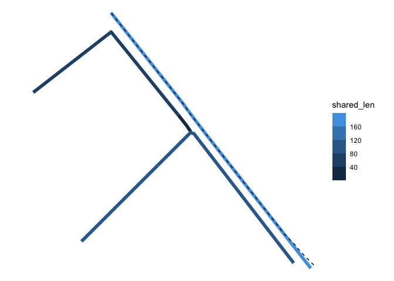

# ANIME: Approximate Network Integration, Matching, and Enrichment


ANIME is a fast and efficient algorithm to perform partial linestring
matching and attribute interpolation between two sets of linestrings.

The core algorithm is implemented in the `anime` Rust crate ([see Rust
docs](https://docs.rs/anime/)) with bindings to the algorithm in both R
and Python.

## What it does

The `anime` algorithm calculates the approximate shared length between
two sets of linestrings within a specified **distance** and **angle**
tolerance.

For each source linestring, the distance of overlap with a target
linestring is stored. The distance of overlap is then used to perform
intensive or extensive interpolation of attributes.

## Example

``` r
library(sf)
library(dplyr)
library(anime)
library(ggplot2)

# get sample lines from package
targets_fp <- system.file("extdata", "maine-osm-targets.fgb", package = "anime")
sources_fp <- system.file("extdata", "maine-tigris-sources.fgb", package = "anime")

# read files
targets <- read_sf(targets_fp)
sources <- read_sf(sources_fp)

matches <- anime(
    sources,
    targets,
    10, 5
)

# extract matches as a data.frame
match_tbl <- get_matches(matches)
match_tbl
```

    # A data frame: 23 × 5
       target_id source_id shared_len source_weighted target_weighted
     *     <int>     <int>      <dbl>           <dbl>           <dbl>
     1         1         1       73.5           1.00            1.25 
     2         2         1       50.0           0.680           0.933
     3         3         1       73.5           1.00            0.991
     4         4         2        0             0               0    
     5         6         1        0             0               0    
     6         7         2        0             0               0    
     7         8         2        0             0               0    
     8        11         1       18.7           0.255           0.752
     9        12         2      170.            0.895           0.894
    10        13         3      132.            0.983           0.993
    # ℹ 13 more rows

``` r
# find most matched source
most_matched_source <- count(match_tbl, source_id, sort = TRUE) |>
  slice(1) |>
  pull(source_id)

# find the matched targets in the sf object
matched_tars <- match_tbl |>
  filter(source_id == most_matched_source, shared_len > 0) |>
  inner_join(transmute(targets, target_id = row_number())) |>
  st_as_sf()

# visualize them
ggplot() +
  geom_sf(aes(color = shared_len), matched_tars, lwd = 2) +
  geom_sf(data = sources[most_matched_source, ], lty = 2) +
  scale_color_binned() +
  theme_void()
```


