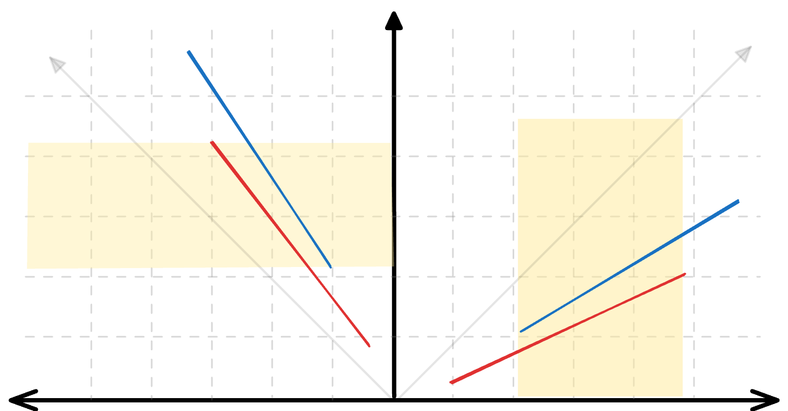

```{r}
#| label: setup-data
#| include: false
# Ensure data directory exists and download datasets if missing
data_dir <- "../data"
if (!dir.exists(data_dir)) {
    dir.create(data_dir)
}

datasets <- c(
    "NPT.gpkg", "os_edinburgh.gpkg", "os_glasgow.gpkg",
    "osm_bus_route.gpkg", "osm_edinburgh.gpkg", "osm_glasgow.gpkg"
)

base_url <- "https://github.com/wangzhao0217/anime/releases/download/sample_data"

for (ds in datasets) {
    dest_path <- file.path(data_dir, ds)
    if (!file.exists(dest_path)) {
        message(paste("Downloading", ds, "..."))
        download.file(file.path(base_url, ds), dest_path, mode = "wb")
    }
}
```

```{r}
#| label: install-dependencies
#| eval: false
if (!"quarto" %in% rownames(installed.packages())) {
    install.packages("quarto")
    pak::pak("josiahparry/anime/r")
    pak::pak("josiahparry/rsgeo")
}
quarto::quarto_render("paper/README.qmd")
```

```{r}
#| label: validation-protocol
#| include: false
# The road-name validation protocol of @sec-validation is defined once here, so
# that the abstract, the validation tables, the baseline comparison, the
# parameter sweep and the interval estimates all derive from one implementation.
suppressMessages(library(sf))
suppressMessages(library(dplyr))

# Restrict both layers to the road names present in both. Each shared name is
# given an identifier used only to label features, never averaged.
# Names are compared exactly by default, which is the protocol stated in
# @sec-protocol. The `norm` argument exists so that the sensitivity of the ground
# truth to that choice can be measured rather than assumed away (@sec-validation limits).
prepare_validation <- function(os_path, osm_path, norm = identity) {
    os <- st_read(os_path, quiet = TRUE)
    osm <- suppressWarnings(st_cast(st_read(osm_path, quiet = TRUE), "LINESTRING"))
    os_key <- norm(os$name)
    osm_key <- norm(osm$name)
    common <- intersect(unique(na.omit(os_key)), unique(na.omit(osm_key)))
    lkp <- data.frame(name = common, name_id = seq_along(common))
    os$name_id <- lkp$name_id[match(os_key, lkp$name)]
    osm$name_id <- lkp$name_id[match(osm_key, lkp$name)]
    list(
        os = os[!is.na(os$name_id), ], osm = osm[!is.na(osm$name_id), ],
        common_names = common
    )
}

# Prediction rule for a nominal attribute: accumulate weight per candidate name
# against each target and take the name with the greatest accumulated weight
# (ties resolved by the lower identifier). A target with no positively weighted
# candidate is left unmatched. Applied identically to ANIME and to every
# baseline, so that only the weight differs between methods.
predict_argmax <- function(target_id, source_name_id, weight, n_target) {
    out <- rep(NA_integer_, n_target)
    keep <- weight > 0
    if (!any(keep)) {
        return(out)
    }
    agg <- data.frame(t = target_id[keep], c = source_name_id[keep], w = weight[keep]) |>
        group_by(t, c) |>
        summarise(w = sum(w), .groups = "drop") |>
        arrange(t, desc(w), c) |>
        group_by(t) |>
        slice(1) |>
        ungroup()
    out[agg$t] <- as.integer(agg$c)
    out
}

# Confusion matrix over target features. A mislabeled target counts as a false
# positive for the name it was given and as a false negative for its true name,
# so recall equals accuracy over all targets and precision equals accuracy
# conditional on a match being returned.
score_targets <- function(pred, truth) {
    matched <- !is.na(pred)
    correct <- matched & (pred == truth)
    TP <- sum(correct)
    FP <- sum(matched & !correct)
    FN <- sum(!matched) + FP
    precision <- TP / (TP + FP)
    recall <- TP / (TP + FN)
    list(
        TP = TP, FP = FP, FN = FN, n = length(truth), matched = matched,
        correct = correct, precision = precision, recall = recall,
        f1 = 2 * precision * recall / (precision + recall)
    )
}

# ANIME arm: weight = shared length accumulated per name.
anime_predict <- function(os, osm, dt = 15, at = 15) {
    m <- as.data.frame(anime::anime(osm, os, dt, at))
    predict_argmax(m$target_id, osm$name_id[m$source_id], m$shared_len, nrow(os))
}

edinburgh <- prepare_validation(
    "../data/os_edinburgh.gpkg",
    "../data/osm_edinburgh.gpkg"
)
os_valid <- edinburgh$os
osm_valid <- edinburgh$osm
common_names <- edinburgh$common_names

predicted <- anime_predict(os_valid, osm_valid, 15, 15)
anime_edi <- score_targets(predicted, os_valid$name_id)

TP <- anime_edi$TP
FP <- anime_edi$FP
FN <- anime_edi$FN
precision <- anime_edi$precision
recall <- anime_edi$recall
f1_score <- anime_edi$f1
abstract_f1 <- anime_edi$f1
match_correct <- anime_edi$correct
has_match <- anime_edi$matched
n_os_features <- nrow(os_valid)
n_osm_features <- nrow(osm_valid)
n_common_names <- length(common_names)
n_unmatched <- sum(!has_match)

# --- Sensitivity of the ground truth to exact string equality on names.
# The protocol compares names exactly, so 'High Street' and 'high  street'
# would be treated as distinct and both features dropped from the shared-name
# set. The same construction is repeated under case folding and whitespace
# normalization, and the whole Edinburgh experiment rescored on it, so that the
# cost of the choice is measured rather than argued about. Abbreviation
# expansion ('St' to 'Street') is deliberately not attempted: it requires a
# gazetteer and would change the ground truth rather than normalize it.
norm_name <- function(x) trimws(gsub("[[:space:]]+", " ", tolower(x)))
edinburgh_norm <- prepare_validation(
    "../data/os_edinburgh.gpkg",
    "../data/osm_edinburgh.gpkg", norm_name
)
anime_edi_norm <- score_targets(
    anime_predict(edinburgh_norm$os, edinburgh_norm$osm, 15, 15),
    edinburgh_norm$os$name_id
)
n_common_names_norm <- length(edinburgh_norm$common_names)
n_os_features_norm <- nrow(edinburgh_norm$os)
f1_norm_delta <- anime_edi_norm$f1 - anime_edi$f1
norm_material <- if (abs(f1_norm_delta) < 0.005) {
    paste0(
        "The exact-equality protocol is therefore not a material determinant of the reported ",
        "scores on these extracts: the two producers render the shared names near-identically, ",
        "so normalization admits almost nothing that exact equality excluded."
    )
} else {
    paste0(
        "The exact-equality protocol therefore does affect the reported scores materially, and ",
        "the normalized construction should be preferred to it."
    )
}

# --- Offset distribution between the two layers, for @sec-parameters ----
# Minimum distance from each OS feature to the nearest OSM feature carrying the
# same road name: the positional offset the distance tolerance must absorb.
distances_to_match <- sapply(seq_len(nrow(os_valid)), function(i) {
    same_name_osm <- osm_valid[osm_valid$name == os_valid$name[i], ]
    if (nrow(same_name_osm) == 0) {
        return(NA)
    }
    as.numeric(min(st_distance(st_geometry(os_valid)[i], same_name_osm)))
})

dist_median <- median(distances_to_match, na.rm = TRUE)
dist_p95 <- quantile(distances_to_match, 0.95, na.rm = TRUE)
dist_p99 <- quantile(distances_to_match, 0.99, na.rm = TRUE)
pct_within_15m <- mean(distances_to_match <= 15, na.rm = TRUE) * 100
pct_within_10m <- mean(distances_to_match <= 10, na.rm = TRUE) * 100
# The distribution is strongly bimodal: a near mode of genuine positional
# offset and a far mode of same-name features belonging to different roads.
pct_beyond_50m <- mean(distances_to_match > 50, na.rm = TRUE) * 100

# The held-out city is prepared here by the same function, so that every
# validation layer used anywhere in this manuscript originates in one chunk.
glasgow <- prepare_validation(
    "../data/os_glasgow.gpkg",
    "../data/osm_glasgow.gpkg"
)
os_valid_gla <- glasgow$os
osm_valid_gla <- glasgow$osm
common_names_gla <- glasgow$common_names

# Percentage formatter, used from the abstract onwards.
pc <- function(x) sprintf("%.1f%%", 100 * x)
# Small counts are spelled out in prose and captions. The numeral is returned
# for anything outside the spelled range, so that a caption built from a count
# that grows cannot silently become NA.
num_word <- function(k) {
    words <- c(
        "no", "one", "two", "three", "four", "five", "six", "seven",
        "eight", "nine", "ten"
    )
    ifelse(is.finite(k) & k >= 0 & k <= 10, words[pmin(pmax(k, 0), 10) + 1L],
        formatC(k, format = "d", big.mark = ",")
    )
}
Num_word <- function(k) sub("^(.)", "\\U\\1", num_word(k), perl = TRUE)
```

```{r}
#| label: format-helpers
#| include: false
thou <- function(x) formatC(round(x), format = "d", big.mark = ",")
```

```{r}
#| label: baselines-edinburgh
#| include: false
# Baseline arms for @sec-comparison. Computed here, before the abstract, because
# the abstract reports the comparison; each arm predicts a name for the same
# target features under the same prediction rule and the same confusion matrix,
# so only the weight assigned to a candidate differs between methods.

# Buffer baseline: candidates are the source features intersecting a buffer of
# the target. The length-weighted variant replaces ANIME's shared length with
# the length of the source feature lying inside that buffer; the count variant
# gives every candidate equal weight.
buffer_predict <- function(os, osm, d = 15, weighted = TRUE) {
    buf <- st_buffer(st_geometry(os), d)
    hits <- st_intersects(buf, st_geometry(osm))
    tid <- rep(seq_along(hits), lengths(hits))
    sid <- unlist(hits)
    if (!length(sid)) {
        return(rep(NA_integer_, nrow(os)))
    }
    if (weighted) {
        w <- numeric(length(sid))
        for (j in unique(tid)) {
            k <- which(tid == j)
            inter <- suppressWarnings(st_intersection(st_geometry(osm)[sid[k]], buf[j]))
            len <- if (length(inter)) as.numeric(st_length(inter)) else rep(0, length(k))
            w[k] <- len[seq_along(k)]
        }
    } else {
        w <- rep(1, length(sid))
    }
    predict_argmax(tid, osm$name_id[sid], w, nrow(os))
}

# Nearest-feature baseline: the single closest source feature, provided it lies
# within the same distance tolerance ANIME is given.
nearest_predict <- function(os, osm, d = 15) {
    nn <- st_nearest_feature(st_geometry(os), st_geometry(osm))
    dist <- as.numeric(st_distance(st_geometry(os), st_geometry(osm)[nn],
        by_element = TRUE
    ))
    pred <- as.integer(osm$name_id[nn])
    pred[is.na(nn) | dist > d] <- NA_integer_
    pred
}

buf_edi <- score_targets(
    buffer_predict(os_valid, osm_valid, 15, TRUE),
    os_valid$name_id
)
bufc_edi <- score_targets(
    buffer_predict(os_valid, osm_valid, 15, FALSE),
    os_valid$name_id
)
nn_edi <- score_targets(
    nearest_predict(os_valid, osm_valid, 15),
    os_valid$name_id
)

# --- Interval estimates for Edinburgh (@sec-bootstrap). Computed here, before
# the abstract, because the abstract reports the paired margin over the primary
# control. The Glasgow companion is computed in the bootstrap-intervals chunk,
# where the Glasgow arms first exist.
BOOT_R <- 1000
BOOT_SEED <- 42

boot_metrics <- function(arms, blocks = NULL, B = BOOT_R, seed = BOOT_SEED) {
    set.seed(seed)
    n <- length(arms[[1]]$correct)
    bl <- if (is.null(blocks)) NULL else split(seq_len(n), blocks)
    out <- lapply(arms, function(a) matrix(NA_real_, B, 3))
    for (b in seq_len(B)) {
        if (is.null(bl)) {
            idx <- sample.int(n, n, replace = TRUE)
        } else {
            acc <- integer(0)
            while (length(acc) < n) acc <- c(acc, bl[[sample.int(length(bl), 1)]])
            idx <- acc
        }
        for (nm in names(arms)) {
            cr <- arms[[nm]]$correct[idx]
            mt <- arms[[nm]]$matched[idx]
            TPb <- sum(cr)
            FPb <- sum(mt & !cr)
            FNb <- sum(!mt) + FPb
            Pb <- TPb / (TPb + FPb)
            Rb <- TPb / (TPb + FNb)
            out[[nm]][b, ] <- c(Pb, Rb, 2 * Pb * Rb / (Pb + Rb))
        }
    }
    lapply(out, function(m) {
        colnames(m) <- c("precision", "recall", "f1")
        m
    })
}

arms_edi <- list(anime = anime_edi, buffer = buf_edi)
boot_iid <- boot_metrics(arms_edi)
os_centroids <- suppressWarnings(sf::st_coordinates(
    sf::st_centroid(sf::st_geometry(os_valid))
))
grid_block <- paste(os_centroids[, 1] %/% 1000, os_centroids[, 2] %/% 1000)
n_blocks <- length(unique(grid_block))
boot_blk <- boot_metrics(arms_edi, blocks = grid_block)

ci_row <- function(m, metric, point) {
    q <- stats::quantile(m[, metric], c(0.025, 0.975))
    sprintf(
        "%.1f%% | %.1f%% | %.1f%%–%.1f%%", 100 * point, 100 * mean(m[, metric]),
        100 * q[1], 100 * q[2]
    )
}
ci_txt <- function(m, metric) {
    q <- stats::quantile(m[, metric], c(0.025, 0.975))
    sprintf("%.1f%%–%.1f%%", 100 * q[1], 100 * q[2])
}

# Paired differences between ANIME and the primary control, computed within
# replicate so that the interval accounts for their correlation, under both
# resampling schemes: feature resampling treats errors as independent, block
# resampling does not.
paired <- function(bt, metric) {
    d <- bt$anime[, metric] - bt$buffer[, metric]
    q <- stats::quantile(d, c(0.025, 0.975))
    list(
        d = d, lo = q[[1]], hi = q[[2]], p_le0 = mean(d <= 0),
        txt = sprintf("%+.2f to %+.2f", 100 * q[[1]], 100 * q[[2]])
    )
}
pd_f1_iid <- paired(boot_iid, "f1")
pd_f1_blk <- paired(boot_blk, "f1")
pd_pr_iid <- paired(boot_iid, "precision")
pd_pr_blk <- paired(boot_blk, "precision")
# Whether a paired interval clears zero is read from the interval, never asserted.
verdict <- function(p) if (p$lo > 0) "excludes zero" else "includes zero"
# Two schemes reported together, collapsed when they agree so that the prose does
# not repeat the same verdict twice.
two_verdicts <- function(p_blk, p_iid) {
    vb <- verdict(p_blk)
    vi <- verdict(p_iid)
    if (identical(vb, vi)) {
        paste0(vb, " under both resampling schemes")
    } else {
        paste0(vb, " under block resampling and ", vi, " under feature resampling")
    }
}

# --- Robustness of the block-resampling scheme (@tbl-block-sensitivity) -------
# The paired ΔF1 verdict rests on one a-priori block size and one grid origin,
# both of which are arbitrary. Blocks of 500 m and 2 km bracket the 1 km choice,
# and a 500 m diagonal shift of the origin tests the placement of the grid at the
# a-priori size. Every scheme uses the same replicates and seed as @tbl-bootstrap.
block_key <- function(xy, size, offset = 0) {
    paste((xy[, 1] + offset) %/% size, (xy[, 2] + offset) %/% size)
}
block_schemes <- list(
    "500 m" = block_key(os_centroids, 500),
    "1 km (a priori)" = grid_block,
    "1 km, origin shifted 500 m" = block_key(os_centroids, 1000, 500),
    "2 km" = block_key(os_centroids, 2000)
)
block_sens <- lapply(block_schemes, function(bk) {
    bt <- boot_metrics(arms_edi, blocks = bk)
    list(n = length(unique(bk)), f1 = paired(bt, "f1"), pr = paired(bt, "precision"))
})
block_f1_pos <- vapply(block_sens, function(z) z$f1$lo > 0, logical(1))
block_pr_pos <- vapply(block_sens, function(z) z$pr$lo > 0, logical(1))
block_f1_min_lo <- min(vapply(block_sens, function(z) z$f1$lo, numeric(1)))
block_pr_min_lo <- min(vapply(block_sens, function(z) z$pr$lo, numeric(1)))

# Every sentence in this manuscript that states the *direction* of a bootstrap
# verdict is generated here from the computed intervals rather than written by
# hand. A bootstrap verdict is a property of the seed, the resampling scheme and
# the extract, so hand-written prose can be left asserting the opposite of the
# table beside it by a change in any of the three; these strings cannot.
n_block_schemes <- length(block_sens)
blk_f1_all <- all(block_f1_pos)
blk_pr_all <- all(block_pr_pos)
pp2 <- function(x) sprintf("%+.2f", 100 * x)

# (a) The abstract, which must carry its content without pointing into the body.
blk_f1_abstract <- if (blk_f1_all) {
    paste0(
        "excludes zero under all ", num_word(n_block_schemes), " block sizes and ",
        "grid origins examined, at ", pp2(block_f1_min_lo),
        " percentage points at its narrowest"
    )
} else if (any(block_f1_pos)) {
    paste0(
        "excludes zero under only ", num_word(sum(block_f1_pos)), " of the ",
        num_word(n_block_schemes), " block sizes and grid origins examined, so its ",
        "verdict turns on the resampling scheme"
    )
} else {
    "includes zero under every block size and grid origin examined"
}

# (b) The closing sentences of @sec-bootstrap.
blk_f1_close <- if (blk_f1_all) {
    paste0(
        "The exclusion verdict on the F1 margin therefore survives every block size ",
        "and origin tested, although its lower bound remains small under all of them, ",
        "at ", pp2(block_f1_min_lo), " percentage points at its narrowest."
    )
} else if (any(block_f1_pos)) {
    paste0(
        "The exclusion verdict on the F1 margin is therefore not robust to the ",
        "resampling scheme: it holds under ", num_word(sum(block_f1_pos)), " of the ",
        num_word(n_block_schemes), " schemes and fails under the rest, so it depends ",
        "on the block size and grid origin fixed a priori rather than being a stable ",
        "property of the data."
    )
} else {
    paste0(
        "The F1 margin includes zero under every block size and origin tested, so no ",
        "exclusion verdict is available for it under spatial resampling at all."
    )
}
# (c) The corresponding clause in @sec-comparison.
blk_f1_sens_clause <- if (blk_f1_all) {
    paste0(
        "That verdict is stable across the arbitrary choices the block scheme embodies: ",
        "under all ", num_word(n_block_schemes), " block sizes and grid origins ",
        "examined the F1 margin clears zero, at ", pp2(block_f1_min_lo),
        " percentage points at its narrowest, so the exclusion is not an artifact of the ",
        "a-priori block choice, although it is a narrow exclusion under every one of them."
    )
} else {
    paste0(
        "That verdict is itself conditional on the block size and grid origin: of the ",
        num_word(n_block_schemes), " schemes examined the F1 margin ",
        "clears zero under ", num_word(sum(block_f1_pos)), ", so it should not be read ",
        "as an established exclusion."
    )
}

# --- The held-out city, under exactly the same protocol and the same two
# resampling schemes. Computed here, before the abstract, because the abstract
# reports held-out results and the direction of every verdict it states must be
# read from the computed intervals rather than written by hand.
predicted_gla <- anime_predict(os_valid_gla, osm_valid_gla, 15, 15)
anime_gla <- score_targets(predicted_gla, os_valid_gla$name_id)
buf_gla <- score_targets(
    buffer_predict(os_valid_gla, osm_valid_gla, 15, TRUE),
    os_valid_gla$name_id
)
bufc_gla <- score_targets(
    buffer_predict(os_valid_gla, osm_valid_gla, 15, FALSE),
    os_valid_gla$name_id
)
nn_gla <- score_targets(
    nearest_predict(os_valid_gla, osm_valid_gla, 15),
    os_valid_gla$name_id
)

# Feature counts and scalar metrics for the held-out city. Unpacked here rather
# than in the body so that @tbl-validation-data and @tbl-validation do not depend
# on a body chunk having run, and can therefore be placed anywhere downstream.
n_os_features_gla <- nrow(os_valid_gla)
n_osm_features_gla <- nrow(osm_valid_gla)
n_common_names_gla <- length(common_names_gla)

# The Glasgow arms themselves are computed in the baselines-edinburgh chunk,
# before the abstract, because the abstract reports held-out results; only the
# quantities derived from them are unpacked here.
TP_gla <- anime_gla$TP
FP_gla <- anime_gla$FP
FN_gla <- anime_gla$FN
precision_gla <- anime_gla$precision
recall_gla <- anime_gla$recall
f1_score_gla <- anime_gla$f1
match_correct_gla <- anime_gla$correct
has_match_gla <- anime_gla$matched
n_unmatched_gla <- sum(!has_match_gla)

arms_gla <- list(anime = anime_gla, buffer = buf_gla)
boot_iid_gla <- boot_metrics(arms_gla)
gla_centroids <- suppressWarnings(sf::st_coordinates(
    sf::st_centroid(sf::st_geometry(os_valid_gla))
))
grid_block_gla <- paste(gla_centroids[, 1] %/% 1000, gla_centroids[, 2] %/% 1000)
n_blocks_gla <- length(unique(grid_block_gla))
boot_blk_gla <- boot_metrics(arms_gla, blocks = grid_block_gla)

pd_f1_iid_gla <- paired(boot_iid_gla, "f1")
pd_f1_blk_gla <- paired(boot_blk_gla, "f1")
pd_pr_iid_gla <- paired(boot_iid_gla, "precision")
pd_pr_blk_gla <- paired(boot_blk_gla, "precision")

# (d) The remaining directional sentences, which depend on the held-out city as
# well as on the scheme sweep.
pr_both_cities <- pd_pr_blk$lo > 0 && pd_pr_blk_gla$lo > 0
blk_argument <- if (blk_pr_all && pr_both_cities) {
    paste0(
        "The argument of @sec-comparison rests on the paired precision margin, whose ",
        "smallest lower bound across the schemes of @tbl-block-sensitivity is ",
        pp2(block_pr_min_lo), " percentage points against ", pp2(block_f1_min_lo),
        " for the F1 margin, and which clears zero in the held-out city as well, where ",
        "the $\\Delta$F1 interval ", two_verdicts(pd_f1_blk_gla, pd_f1_iid_gla), "."
    )
} else {
    paste0(
        "Neither margin clears zero under every scheme of @tbl-block-sensitivity and in ",
        "both cities, so the comparison of @sec-comparison is reported as an ordering of ",
        "point estimates rather than as an interval exclusion."
    )
}
# The abstract's statement of which contrast is the robust one.
pr_abstract <- if (blk_pr_all && pr_both_cities) {
    paste0(
        "clears zero in both cities and under all ", num_word(n_block_schemes),
        " block schemes examined"
    )
} else if (pr_both_cities) {
    paste0(
        "clears zero in both cities under the pre-specified block scheme, though not ",
        "under all ", num_word(n_block_schemes), " schemes examined"
    )
} else {
    "does not clear zero in both cities"
}
# The held-out F1 verdict, stated for both resampling schemes because they agree
# or disagree as the data determine, not as the prose assumes.
# How the held-out F1 verdict should be read. Attributing a non-exclusion to
# spatial dependence is warranted only when the feature-resampling interval
# excludes zero and the block interval does not; otherwise ordinary sampling
# variation already suffices, and the sentence says so.
gla_f1_reading <- if (pd_f1_blk_gla$lo > 0) {
    "is established in the held-out city as well"
} else if (pd_f1_iid_gla$lo > 0) {
    paste0(
        "is not separable from spatially correlated sampling variation in the held-out ",
        "city, where the interval spans zero only once the spatial clustering of errors ",
        "is accounted for"
    )
} else {
    paste0(
        "is not separable from sampling variation in the held-out city, where the ",
        "interval spans zero under feature resampling and under block resampling alike, ",
        "so ordinary sampling variation suffices to explain it without appeal to spatial ",
        "dependence"
    )
}
gla_f1_abstract <- paste0(
    "in the held-out city of Glasgow the same margin is ",
    if (anime_gla$f1 > buf_gla$f1) "positive" else "negative",
    " as a point estimate but its interval ",
    two_verdicts(pd_f1_blk_gla, pd_f1_iid_gla)
)

# The count sentence opening the discussion of @tbl-block-sensitivity.
blk_counts_sentence <- if (blk_pr_all && blk_f1_all) {
    sprintf(
        paste0(
            "Both margins clear zero under all %s schemes, the F1 lower bound falling as ",
            "low as %s percentage points and the precision lower bound no lower than %s."
        ),
        num_word(n_block_schemes), pp2(block_f1_min_lo), pp2(block_pr_min_lo)
    )
} else {
    sprintf(
        paste0(
            "The precision margin clears zero under %s of the %s schemes and the F1 margin ",
            "under %s, with the F1 lower bound falling as low as %s percentage points."
        ),
        num_word(sum(block_pr_pos)), num_word(n_block_schemes),
        num_word(sum(block_f1_pos)), pp2(block_f1_min_lo)
    )
}
block_sens_cap <- paste0(
    "Sensitivity of the Edinburgh paired margins over the length-weighted buffer to the ",
    "block-resampling scheme, in percentage points, at the same ", BOOT_R, " replicates and ",
    "seed ", BOOT_SEED, " as @tbl-bootstrap; blocks are square cells over target centroids ",
    "in British National Grid coordinates."
)
```

```{r}
#| label: compute-transfer-validation
#| include: false
# Quantitative validation of attribute transfer (@sec-transfer-validation).
# Ground truth: the OS Open Roads functional class, recorded independently of the
# road names used for the matching ground truth. The estimators, hypotheses and
# exclusions are stated in @sec-transfer-design.
OS_CLASSES <- c("A Road", "B Road", "Minor Road")
OS_ORDINAL <- c("Minor Road" = 1, "B Road" = 2, "A Road" = 3)
OSM_CROSSWALK <- c(
    primary = "A Road", primary_link = "A Road",
    secondary = "B Road", secondary_link = "B Road",
    tertiary = "Minor Road", tertiary_link = "Minor Road",
    unclassified = "Minor Road"
)

transfer_experiment <- function(os, osm) {
    osm$os_class <- unname(OSM_CROSSWALK[osm$road_function])
    stopifnot(!anyNA(osm$os_class), all(os$road_function %in% OS_CLASSES))
    m <- anime::anime(osm, os, 15, 15)
    mdf <- as.data.frame(m)

    # E1: one indicator column per class, transferred intensively, then argmax.
    shares <- vapply(
        OS_CLASSES,
        function(cl) {
            anime::interpolate_intensive(
                as.numeric(osm$os_class == cl), m
            )
        },
        numeric(nrow(os))
    )
    tot <- rowSums(shares)
    pred <- ifelse(tot > 0, OS_CLASSES[max.col(shares, ties.method = "first")],
        NA_character_
    )
    correct <- !is.na(pred) & pred == os$road_function
    e1_acc <- sum(correct) / nrow(os)

    # Nearest-feature control on the same attribute.
    nn <- sf::st_nearest_feature(sf::st_geometry(os), sf::st_geometry(osm))
    nnd <- as.numeric(sf::st_distance(sf::st_geometry(os),
        sf::st_geometry(osm)[nn],
        by_element = TRUE
    ))
    nn_cls <- osm$os_class[nn]
    nn_cls[nnd > 15] <- NA_character_
    nn_acc <- sum(!is.na(nn_cls) & nn_cls == os$road_function) / nrow(os)

    # Ceiling: the class carried by the same-named source feature lying closest.
    orc <- vapply(seq_len(nrow(os)), function(i) {
        cand <- which(osm$name == os$name[i])
        if (!length(cand)) {
            return(NA_character_)
        }
        d <- as.numeric(sf::st_distance(
            sf::st_geometry(os)[i],
            sf::st_geometry(osm)[cand]
        ))
        osm$os_class[cand[which.min(d)]]
    }, character(1))
    orc_acc <- sum(!is.na(orc) & orc == os$road_function) / nrow(os)

    # E2: ordinal encoding transferred intensively; scored where a match exists.
    hat <- anime::interpolate_intensive(unname(OS_ORDINAL[osm$os_class]), m)
    truth <- unname(OS_ORDINAL[os$road_function])
    ok <- tot > 0

    # E3: source length transferred extensively; conservation of the total.
    slen <- as.numeric(sf::st_length(osm))
    hat_ext <- anime::interpolate_extensive(slen, m)
    src_matched <- sort(unique(mdf$source_id))
    sw_sum <- tapply(mdf$source_weighted, mdf$source_id, sum)
    # A relative tolerance, so that floating-point residue at 1 + 1e-9 is not
    # reported as a ratio exceeding one.
    TOL <- 1e-6

    # Per-class recall, for the confusion summary.
    cls_tbl <- data.frame(
        Class = OS_CLASSES,
        Targets = vapply(OS_CLASSES, function(cl) sum(os$road_function == cl), integer(1)),
        Recall = vapply(OS_CLASSES, function(cl) {
            sum(correct & os$road_function == cl) / sum(os$road_function == cl)
        }, numeric(1)),
        Precision = vapply(OS_CLASSES, function(cl) {
            sum(correct & pred == cl, na.rm = TRUE) /
                max(1L, sum(!is.na(pred) & pred == cl))
        }, numeric(1)),
        row.names = NULL
    )

    list(
        n = nrow(os), e1_acc = e1_acc, n_unpred = sum(is.na(pred)),
        nn_acc = nn_acc, orc_acc = orc_acc, cls_tbl = cls_tbl,
        # Per-target correctness of E1 and of its control, retained so that the
        # accuracy contrast can be tested pairwise on the same target features
        # rather than compared as two independent point estimates.
        e1_correct = correct,
        nn_correct = !is.na(nn_cls) & nn_cls == os$road_function,
        centroids = suppressWarnings(sf::st_coordinates(
            sf::st_centroid(sf::st_geometry(os))
        )),
        e2_n = sum(ok),
        e2_mae = mean(abs(hat[ok] - truth[ok])),
        e2_rmse = sqrt(mean((hat[ok] - truth[ok])^2)),
        e2_sd = sqrt(mean((truth[ok] - mean(truth[ok]))^2)),
        cons_all = sum(hat_ext) / sum(slen),
        cons_matched = sum(hat_ext) / sum(slen[src_matched]),
        n_src = nrow(osm), n_src_matched = length(src_matched),
        sw_lt1 = mean(sw_sum < 1 - TOL), sw_gt1 = mean(sw_sum > 1 + TOL),
        sw_max = max(sw_sum),
        rec_sw_gt1 = mean(mdf$source_weighted > 1 + TOL),
        rec_tw_gt1 = mean(mdf$target_weighted > 1 + TOL),
        max_sw = max(mdf$source_weighted), max_tw = max(mdf$target_weighted)
    )
}

tx_edi <- transfer_experiment(os_valid, osm_valid)
tx_gla <- transfer_experiment(os_valid_gla, osm_valid_gla)

# Decomposition of the residual error of E1 into the part no matcher could avoid
# and the part the matching and transfer add. It is stated in percentage points
# rather than as the ratio E1/ceiling, because attaining 93% of a ceiling of 99%
# is a shortfall of 7 points, not of 1: the ratio invites exactly the inverted
# attribution it is used to support.
tx_gap <- function(tx) {
    list(
        cross = 1 - tx$orc_acc,
        transfer = tx$orc_acc - tx$e1_acc,
        unpred = tx$n_unpred / tx$n
    )
}
gap_edi <- tx_gap(tx_edi)
gap_gla <- tx_gap(tx_gla)
tx_gap_clause <- function(g, city) {
    if (g$transfer > g$cross) {
        sprintf(
            paste0(
                "in %s the matching and transfer contribute the larger part, %.1f ",
                "percentage points against %.1f for the crosswalk"
            ),
            city, 100 * g$transfer, 100 * g$cross
        )
    } else {
        sprintf(
            paste0(
                "in %s the crosswalk contributes the larger part, %.1f percentage ",
                "points against %.1f for the matching and transfer"
            ),
            city, 100 * g$cross, 100 * g$transfer
        )
    }
}
# The unpredicted share is reported against the shortfall it is meant to explain,
# uncapped: where it exceeds the shortfall the sentence says so, because a ratio
# silently clipped to 100% would hide that the coverage failure is larger than
# the whole gap to the reference.
tx_unpred_clause <- function(g) {
    r <- g$unpred / g$transfer
    if (is.finite(r) && r > 1) {
        sprintf(
            paste0(
                "%s of all targets are left unpredicted because no source feature matched them, ",
                "which more than accounts for that shortfall of %s"
            ),
            pc(g$unpred), pc(g$transfer)
        )
    } else {
        sprintf(
            paste0(
                "%s of all targets are left unpredicted because no source feature matched them, ",
                "which accounts for %s of that shortfall"
            ),
            pc(g$unpred), sprintf("%.0f%%", 100 * r)
        )
    }
}
tx_gap_sentence <- {
    edi_bigger <- gap_edi$transfer > gap_edi$cross
    gla_bigger <- gap_gla$transfer > gap_gla$cross
    if (edi_bigger == gla_bigger) {
        sprintf(
            paste0(
                "in both cities the %s contribute%s the larger part: %.1f percentage points ",
                "against %.1f in Edinburgh, and %.1f against %.1f in Glasgow"
            ),
            if (edi_bigger) "matching and transfer" else "crosswalk",
            if (edi_bigger) "" else "s",
            100 * (if (edi_bigger) gap_edi$transfer else gap_edi$cross),
            100 * (if (edi_bigger) gap_edi$cross else gap_edi$transfer),
            100 * (if (gla_bigger) gap_gla$transfer else gap_gla$cross),
            100 * (if (gla_bigger) gap_gla$cross else gap_gla$transfer)
        )
    } else {
        paste0(
            tx_gap_clause(gap_edi, "Edinburgh"), ", whereas ",
            tx_gap_clause(gap_gla, "Glasgow")
        )
    }
}
tx_cov_share <- function(g) g$unpred / g$transfer
tx_cov_word <- function(g) {
    r <- tx_cov_share(g)
    if (!is.finite(r)) "not measurably" else if (r > 0.9) "almost entirely" else if (r > 0.5) "predominantly" else if (r > 0.25) "in substantial part" else "only in part"
}

# Paired inference on the E1-versus-control accuracy contrast, using the same
# procedure as the matching experiment of @sec-bootstrap: an exact McNemar test
# on the discordant targets, plus paired bootstrap intervals on the accuracy
# difference under feature resampling and under 1 km block resampling.
TX_B <- 1000
TX_SEED <- 42
# The transfer contrast is held to the same robustness standard as the matching
# contrast of @sec-comparison: the identical grid of block sizes and grid
# origins used in @tbl-block-sensitivity, rather than the single a-priori 1 km
# scheme alone. Each entry is (block size in metres, origin offset in metres).
TX_BLOCK_SCHEMES <- list(
    "500 m" = c(500, 0), "1 km (a priori)" = c(1000, 0),
    "1 km, origin shifted 500 m" = c(1000, 500),
    "2 km" = c(2000, 0)
)
transfer_contrast <- function(tx, schemes = TX_BLOCK_SCHEMES) {
    a <- tx$e1_correct
    b <- tx$nn_correct
    nb <- sum(a & !b)
    nc <- sum(!a & b)
    n <- length(a)
    set.seed(TX_SEED)
    d_iid <- vapply(seq_len(TX_B), function(r) {
        idx <- sample.int(n, n, replace = TRUE)
        mean(a[idx]) - mean(b[idx])
    }, numeric(1))
    blk <- lapply(schemes, function(s) {
        key <- paste(
            (tx$centroids[, 1] + s[2]) %/% s[1],
            (tx$centroids[, 2] + s[2]) %/% s[1]
        )
        blocks <- split(seq_len(n), key)
        set.seed(TX_SEED)
        d <- vapply(seq_len(TX_B), function(r) {
            acc <- integer(0)
            while (length(acc) < n) acc <- c(acc, blocks[[sample.int(length(blocks), 1)]])
            mean(a[acc]) - mean(b[acc])
        }, numeric(1))
        q <- stats::quantile(d, c(0.025, 0.975))
        list(
            n_blocks = length(blocks), lo = q[[1]], hi = q[[2]],
            txt = sprintf("%+.2f to %+.2f", 100 * q[[1]], 100 * q[[2]])
        )
    })
    qi <- stats::quantile(d_iid, c(0.025, 0.975))
    ap <- blk[["1 km (a priori)"]]
    list(
        b = nb, c = nc, n_blocks = ap$n_blocks,
        p = stats::binom.test(nb, nb + nc, 0.5)$p.value,
        d = mean(a) - mean(b),
        iid = sprintf("%+.2f to %+.2f", 100 * qi[[1]], 100 * qi[[2]]),
        blk = ap$txt, iid_lo = qi[[1]], blk_lo = ap$lo,
        blk_all = blk,
        blk_pos = vapply(blk, function(z) z$lo > 0, logical(1)),
        blk_min_lo = min(vapply(blk, function(z) z$lo, numeric(1)))
    )
}
tc_edi <- transfer_contrast(tx_edi)
tc_gla <- transfer_contrast(tx_gla)
tc_p_holm <- stats::p.adjust(c(tc_edi$p, tc_gla$p), method = "holm")
# Directional prose for the transfer contrast, generated from the intervals for
# the same reason as the matching verdicts of @sec-bootstrap.
tc_blk_all <- all(tc_edi$blk_pos) && all(tc_gla$blk_pos)
tc_n_schemes <- length(TX_BLOCK_SCHEMES)
tc_abstract <- if (tc_blk_all) {
    paste0(
        "excludes zero in both cities under all ", num_word(tc_n_schemes),
        " block sizes and grid origins examined"
    )
} else if (tc_edi$blk_lo > 0 && tc_gla$blk_lo > 0) {
    paste0(
        "excludes zero in both cities under the pre-specified 1 km block scheme but ",
        "not under all ", num_word(tc_n_schemes), " schemes examined"
    )
} else if (tc_edi$blk_lo > 0 || tc_gla$blk_lo > 0) {
    "excludes zero in one city but not the other"
} else {
    "includes zero in both cities"
}
tc_sens_sentence <- if (tc_blk_all) {
    paste0(
        "Repeating the block bootstrap over ", num_word(tc_n_schemes),
        " block sizes and grid origins leaves the verdict ",
        "unchanged in both cities: the smallest lower bound across the schemes is ",
        sprintf("%+.2f", 100 * tc_edi$blk_min_lo), " percentage points in Edinburgh and ",
        sprintf("%+.2f", 100 * tc_gla$blk_min_lo), " in Glasgow, so this contrast, unlike ",
        "the matching contrast, does not sit close enough to zero for the arbitrary ",
        "choices in the block scheme to matter."
    )
} else {
    paste0(
        "Repeating the block bootstrap over ", num_word(tc_n_schemes),
        " block sizes and grid origins does not leave the ",
        "verdict unchanged: the interval excludes zero under ",
        num_word(sum(tc_edi$blk_pos)), " of the ", num_word(tc_n_schemes),
        " schemes in Edinburgh and ", num_word(sum(tc_gla$blk_pos)), " of the ",
        num_word(tc_n_schemes), " in Glasgow, with smallest lower bounds of ",
        sprintf("%+.2f", 100 * tc_edi$blk_min_lo), " and ",
        sprintf("%+.2f", 100 * tc_gla$blk_min_lo), " percentage points. ",
        if (all(tc_edi$blk_pos)) {
            "The advantage in the development city therefore survives the sweep"
        } else {
            "The advantage in the development city does not survive the sweep"
        },
        ", whereas ",
        if (all(tc_gla$blk_pos)) {
            paste0(
                "the held-out advantage does so as well, and both may be read as interval ",
                "exclusions."
            )
        } else {
            paste0(
                "the held-out advantage does not, and it is reported here as a point estimate ",
                "rather than as an established exclusion; the transfer contrast is claimed as ",
                "established in the development city alone, on the same standard @sec-comparison ",
                "applies to the matching contrast."
            )
        }
    )
}
```


# Abstract {.unnumbered}

Identifying correspondence between linestring geometries in the absence of a shared unique identifier continues to challenge spatial data science.
Existing methods generally represent correspondence as binary, using buffer or distance rules.
However, the extent to which two linestrings correspond can be expressed as a continuous measure of overlap rather than as an assumption of equality.
This paper presents ANIME (Approximate Network Integration, Matching and Enrichment), a linestring matching algorithm that calculates shared lengths between linestring sets with many-to-many relationships.
The algorithm uses R*-tree spatial indexing with angle and distance-based matching thresholds, combined with overlap computation methods that adapt to line segment orientation.
The resultant measure of shared lengths ($SL_{ij}$) between features enables extensive and intensive interpolation methods for attribute transfer.
The ANIME algorithm is implemented in `anime`, a Rust crate with bindings to the R and Python programming languages.
A case study on Scottish transport networks matches detailed to generalized geometries and transfers attributes, achieving an F1-score of `r pc(f1_score)` on the Edinburgh development network and `r pc(f1_score_gla)` on the held-out Glasgow network.
Its application to transport planning is demonstrated.

# Keywords {.unnumbered}

Network Conflation, Spatial Data Integration, Geometric Matching, Many-to-Many Matching, Attribute Interpolation



# Highlights {.unnumbered}

- Decomposes linestrings into segments and identifies candidate matches by spatial indexing.
- Measures continuous correspondence using shared lengths, natively supporting $m:n$ relationships.
- Enables extensive and intensive attribute interpolation grounded in spatial interpolation theory.
- Validates attribute transfer against independent network classifications across two city baselines.
- Provides an open-source Rust implementation with R and Python bindings for reproducibility.



# Introduction

Reconciling linestring datasets from disparate sources remains a fundamental challenge in spatial data science.
Transport planning increasingly requires integrating linear network representations from diverse sources (government agencies, commercial providers, and crowd-sourced platforms) that differ in topology, geometry, and attributes.
Join keys are typically absent, making it unclear which features correspond between datasets.
Even when corresponding features can be identified, direct attribute transfer is often inappropriate.
For example, attributes such as speed limits or traffic volumes are associated with specific geometries that may lack direct counterparts in the target dataset.
A weighted approach is therefore necessary to associate attributes accurately during integration.
As @lei_optimal_2019 observed, "due to the complexity and limitations of existing methods, planners and analysts often have to employ a heavily manual conflation^[Conflation is a two-step process that first identifies corresponding geometries between datasets and then transfers attributes between matched features.] process, which is time-consuming and often prohibitively expensive."

The need for robust automated integration methods is growing as large volumes of geospatial data emerge from remotely sensed imagery and large-scale feature extraction projects.
These sources can supplement missing information and capture recent infrastructure changes, but they may be incomplete or geometrically imprecise.
Even mature crowd-sourced datasets such as OpenStreetMap exhibit substantial spatial variation in completeness and positional accuracy, with systematic urban-rural gradients [@li_osm_2025; @barrington_leigh_osm_2017].
Several persistent challenges complicate the matching process:

- matching generalized geometry to more detailed representations [@kim_conflation_2017; @mustiere_matching_2008];
- reconciling different representations of the same feature, such as a multi-lane highway depicted as a single line in one dataset and multiple parallel lines in another [@zhang_methods_2009]; and
- addressing one-to-many or many-to-many correspondence scenarios where no simple bijective mapping exists.

In the absence of reliable semantic information or join keys, a purely geometric approach is required [@samal_feature_2004].

## Existing approaches and limitations

Conflation, the process of aligning and integrating geospatial datasets, has been a subject of research for decades [@ruiz_digital_2011], with comprehensive surveys cataloging the extensive range of similarity measures and matching algorithms developed for vector data [@xavier_survey_2016].
The literature predominantly frames network conflation as binary feature classification.
Many existing methods use geometric similarity measures such as proximity, orientation, length ratios, and shape metrics including Fréchet and Hausdorff distances to determine whether source and target features correspond [@samal_feature_2004].

The problem was framed by @saalfeld_conflation_1988, who defined conflation as the automated compilation of a single map from two sources and set out the matching, transformation and merging stages that later work has elaborated.
Buffer based measurement of linear correspondence originates with @goodchild_simple_1997, whose positional accuracy measure expresses the proportion of a tested line's length that falls within a buffer of stated width around a reference line.
This continuous, rather than binary, measure is the closest conceptual precursor to the shared-length metric developed below. However, it is defined for one tested line against one reference line, and it quantifies positional accuracy rather than deciding which features correspond. Shared length generalizes that continuous 1:1 proportion to m:n correspondence measured at the segment level.
Matching procedures built on buffers came later: @walter_matching_1999 recast road network matching as a statistical decision over buffer derived evidence, and @koukoletsos_assessing_2012 combined buffer growing with attribute agreement to match OpenStreetMap against Ordnance Survey Great Britain data (MasterMap Integrated Transport Network rather than the Open Roads product used here).
Correspondence is reduced to a binary classification at that decision step rather than in the underlying measure, and the resulting procedures perform poorly on complex topological relationships.
Feature based approaches [@samal_feature_2004; @mustiere_matching_2008] extended earlier work by incorporating both geometric and topological properties, introducing partial (1:m or m:n) matches through combined bottom-up (local geometric) and top-down (global topological) procedures.
However, such methods often required manual intervention for complex split/merge scenarios, limiting their scalability.

Recent work has recast conflation as an optimization problem, seeking globally optimal match assignments rather than greedy pairwise decisions.
@lei_optimal_2019 developed a network flow-based approach that formulates matching as selecting flows (matches) that minimize total discrepancy, achieving match accuracy exceeding 95% while supporting partial matches through flow splitting.
This framework was extended by @lei_topological_2024 to incorporate topological constraints via an optimized node-arc conflation model, and by @wu_mincost_2022 through min-cost network flow relaxation that achieves optimal matching under geometric constraints.
Graph-based and multi-stage approaches also use spatial decomposition to manage complexity.
@nguyen_apsg_2022 introduced an area partitioning and subgraph growing (APSG) method that uses Voronoi diagrams to partition regions into localities, achieving F1-scores exceeding 0.9 by explicitly handling missing features and representation differences.
Similarly, @wu_voronoi_2023 proposed a Voronoi based road network conflation method (VAMRN) that handles complex match cases (1:1, 1:n, m:n) by combining neighboring segments; across four test datasets they report F-measures 3.8 to 29.6 percentage points above a buffer growing baseline and 1.8 to 6.1 points above probabilistic relaxation, with processing time reduced by more than 90% relative to the latter.
At the production scale, @zhang_methodology_2023 demonstrated statewide road network conflation with approximately 99% match accuracy using intersection based matching with fuzzy logic.

Beyond optimization and graph-based methods, other algorithmic approaches include the delimited strokes algorithm [@zhang_methods_2009], the overline method for flow aggregation [@morgan_travel_2021], and commercial solutions such as Esri's conflation toolset [@esri_conflation_2023].
Recent work has also explored orientation-sensitive similarity measures, with @lei_turning_2021 demonstrating that turning function distance better differentiates road shapes than classic Hausdorff distance, and @chehreghan_new_2017 showing that a descriptor combining distance to extracted landmarks with relative orientation improves the F-score of geometric matching between datasets of differing scale.
Machine learning approaches have attempted to automate classification decisions: @kim_conflation_2017 employed C4.5 decision trees using spatial similarity measures, while more recent deep learning approaches using graph neural networks report gains in identifying complex matching patterns across multi-scale datasets [@huang_gnn_2023].
Despite these advances, most such methods report correspondence as a discrete classification of feature pairs rather than as a continuous measure of overlap.
Moreover, the optimization and graph-based formulations reviewed above can be computationally demanding on large networks.

Availability is a further limitation: most conflation tools are not open source, the most widely used being Esri's proprietary conflation toolset [@esri_conflation_2023].
Open implementations nevertheless exist and constitute the immediate prior art for the present work.
The Java Conflation Suite and its RoadMatcher application distribute a rubber sheeting and network matching workflow under an open license [@davis_java_2003]; Hootenanny provides an actively maintained open conflation stack for vector data, including road networks [@ngageoint_hootenanny_2024]; and the SharedStreets Referencing System offers an open linear referencing scheme designed so that street data from different providers can be exchanged without a shared identifier [@sharedstreets_referencing_2020].
The closest related approach is provided by the `stplanr` R package [@lovelace_stplanr_2018], whose `rnet_join()` and `rnet_merge()` functions [@lovelace_stplanr_pkg_2025] aggregate attributes from a detailed route network onto a simplified one using buffer-based matching and length-weighted aggregation.
The contribution claimed here is accordingly not open-source availability as such, but the combination of a continuous segment-level correspondence measure with theoretically grounded attribute transfer in the same library.

Compared across the dimensions relevant to practical integration (@tbl-comparison), the literature divides on two questions: whether correspondence is reported as a continuous quantity or as a binary decision, and whether an open implementation carries attribute transfer at all.
The only other open method offering length-weighted transfer is `stplanr`'s `rnet_join()`, and ANIME differs from it in the correspondence column alone, reporting a shared length where `rnet_join()` reports buffer overlap.

| Method | Year | Correspondence | Open | Transfer |
|:----------------------------|:---|:------------------|:-----|:---------|
| Buffer overlap measure [@goodchild_simple_1997] | 1997 | 1:1, continuous proportion | Method only | No |
| Statistical buffer matching [@walter_matching_1999] | 1999 | 1:1 and 1:m, binary | No | No |
| JCS / RoadMatcher [@davis_java_2003] | 2003 | 1:1, binary | Yes | No |
| Feature based [@samal_feature_2004] | 2004 | 1:m and m:n, partial | No | No |
| Delimited strokes [@zhang_methods_2009] | 2009 | 1:1, binary | No | No |
| Buffer growing with attributes [@koukoletsos_assessing_2012] | 2012 | 1:1 and 1:m, binary | No | No |
| Network flow [@lei_optimal_2019] | 2019 | m:n, flow values | No | Limited |
| SharedStreets [@sharedstreets_referencing_2020] | 2020 | 1:1 via shared reference | Yes | Yes |
| Min-cost flow [@wu_mincost_2022] | 2022 | m:n, optimal pairs | No | No |
| APSG [@nguyen_apsg_2022] | 2022 | m:n, binary | No | No |
| Voronoi VAMRN [@wu_voronoi_2023] | 2023 | m:n, binary | No | No |
| GNN pattern [@huang_gnn_2023] | 2023 | m:n, pattern labels | No | No |
| Esri conflation [@esri_conflation_2023] | 2023 | 1:1, similarity score | No | Yes |
| Hootenanny [@ngageoint_hootenanny_2024] | 2024 | 1:1, binary with merge | Yes | Yes |
| stplanr rnet_join [@lovelace_stplanr_pkg_2025] | 2025 | m:n, buffer overlap | Yes | Yes, length-weighted |
| **ANIME (this work)** | **2026** | **m:n, shared length** | **Yes** | **Yes, length-weighted** |

: Comparison of network conflation methods. {#tbl-comparison}

## Attribute transfer as spatial interpolation

Attribute transfer has received little rigorous treatment in conflation research.
Transferring data such as traffic counts or road conditions from one network to another is fundamentally a spatial interpolation problem on linear features, yet most conflation methods treat it as a trivial post-processing step with binary correspondence.
Classic areal interpolation theory distinguishes between extensive variables (e.g., counts, lengths) that must be apportioned proportionally and intensive variables (e.g., density, rates) that remain invariant to aggregation [@scheider_extensive_2019].
Recent synthesis across spatial data science languages emphasizes that attribute operations depend on support type (point vs. block) and on intensive versus extensive semantics, which constrains appropriate transfer during conflation [@pebesma_sdsl_2025].
This distinction underpins statistically valid attribute transfer.

@tobler_smooth_1979's pycnophylactic interpolation established the principle of mass conservation for areal data, ensuring that total extensive quantities are preserved during redistribution.
@goodchild_areal_1980 formalized areal interpolation in GIS, introducing area-weighted assumptions for transferring data between zoning systems.
More recent work by @comber_spatial_2019 provides a comprehensive review of interpolation techniques, distinguishing methods that use ancillary data (dasymetric mapping, street-weighted interpolation) from those that develop allocation procedures (pycnophylactic, areal weighting).
Street-length weighting is an established ancillary approach for distributing extensive variables along road networks.
@bentley_network_2013 demonstrated this principle by allocating population data to road networks using dasymetric techniques, directly extending areal interpolation theory to linear features.
These principles provide the theoretical foundation for length-weighted attribute transfer in network conflation.

## Computation, data sources, and reproducibility

At the city-to-national scales at which conflation is usually required, the dominant cost lies in generating and evaluating candidate correspondences, so pipelines separate a fast spatial filtering stage from more detailed geometric checks rather than comparing all pairs.
Spatial indexing structures, notably the R-tree [@guttman_rtrees_1984] and its R*-tree variant [@beckmann_rstartree_1990], perform that filtering by identifying overlapping axis-aligned bounding boxes (AABB), and studies of index-aware implementations continue to report substantial gains for spatial joins and nearest-neighbor search on road data [@kim_sgirtree_2024].
Partitioning and topology-aware decomposition localize the computation further, which matters most when many-to-many correspondences are admissible [@nguyen_apsg_2022; @wu_voronoi_2023].

These constraints are consequential because road networks are now assembled from sources of very different provenance, from authoritative mapping agencies to volunteered geographic information (VGI) platforms.
Early evaluations found urban OpenStreetMap roads to be within 6 meters of UK Ordnance Survey data on average, though completeness and local accuracy varied more [@haklay_good_2010], and later comparison frameworks documented how partial overlaps, misalignment, and attribution differences complicate integration [@brovelli_osm_2016].
Neither source is uniformly superior, so conflating them can improve completeness, positional reliability, and attribute richness relative to either alone, which is what applied transport planning workflows such as the Propensity to Cycle Tool depend on when they combine census inputs, survey data, and basemaps [@lovelace_propensity_2017].

Methodological progress also depends on reproducible implementations.
Assessments of reproducibility in GIScience identify recurring barriers in proprietary software, opaque parameterization, and workflows that cannot be re-run or audited [@kedron_reproducibility_2021], while calls for open practice argue that sharing data, code, and executable workflows supports systematic comparison and cumulative improvement [@holler_open_2025].
Conflation methods that remain academic prototypes or are embedded in closed toolchains satisfy neither condition, which limits independent evaluation and uptake.

## Research gaps and objectives

Despite substantial methodological advances, four limitations recur across the conflation literature.
First, most techniques produce match sets or merged datasets without reporting correspondence measures that can be interpreted as proportional overlap; as a result, downstream analysis often treats matches as binary decisions rather than graded relationships.
Second, while recent optimization- and partitioning-based methods can represent many-to-many ($m:n$) correspondences [@lei_optimal_2019; @nguyen_apsg_2022], these capabilities are frequently obtained through complex modeling choices or post-hoc grouping, and partial matches are rarely treated as primary outputs.
Third, attribute transfer is seldom grounded in spatial interpolation theory: once geometries are aligned, apportionment of extensive variables and treatment of intensive variables are often handled as ad hoc post-processing rather than as a core methodological step.
Fourth, reproducibility remains uneven because many methods are not distributed as usable, open implementations, limiting independent benchmarking and practical adoption.

These limitations share a common cause: conflation is framed as a discrete matching problem even though real networks exhibit partial and overlapping correspondences, and without an explicit measure of overlap there is no defensible basis for propagating information across those relationships or for length-weighted attribute transfer.
This paper presents ANIME (Approximate Network Integration, Matching and Enrichment), a different approach to network conflation that replaces binary matching decisions with quantitative correspondence measurement.
Its central argument is that correspondence should not be assessed between whole `LineString` features but between the elementary two vertex line segments that compose them, because such segments can be compared directly using simple geometric primitives: relative orientation, proximity, and projected overlap.
Aggregating these segment-level comparisons quantifies partial overlaps between features, accommodates complex topological relationships, and provides a statistically sound foundation for weighted attribute transfer.

This work addresses these limitations through four objectives:

1.  **Develop a continuous correspondence measure** that quantifies degrees of geometric overlap rather than binary matching decisions, enabling precise representation of partial correspondences between `LineString` features.

2.  **Establish mathematical foundations** for weighted attribute transfer through rigorous geometric analysis and spatial interpolation theory.

3.  **Design and implement** an algorithmic solution that scales efficiently for large `LineString` datasets while remaining accessible from multiple programming environments.

4.  **Validate the approach** on real-world transportation networks, against baselines scored under one protocol, and report the resulting margins with their sampling uncertainty.

The remainder of the paper is organized as follows.
@sec-methods sets out the mathematical foundation and @sec-implementation the Rust crate and its R and Python bindings.
@sec-evaluation validates ANIME on real-world road network data against a road name ground truth and three baselines, @sec-case-study applies it to four attributes at once, and @sec-limitations and @sec-conclusion cover the bounds on these results.

# Mathematical foundation and methodology {#sec-methods}

ANIME has two components: a geometric matching algorithm that computes shared lengths between features, and attribute interpolation methods that use those shared lengths to transfer values.

## Algorithm parameters

ANIME takes two sets of `LineString` features and two tolerances, a distance tolerance $DT$ and an angle tolerance $AT$, which together determine whether a pair of segments corresponds (@tbl-variables-parameters).

| Variable/Parameter           | Symbol    | Description                                                                    |
| ---------------------------- | --------- | ------------------------------------------------------------------------------ |
| Source features              | $A$       | An array of `LineString` geometries from which attributes are transferred     |
| Target features              | $B$       | An array of `LineString` geometries to which features are being matched       |
| Distance Tolerance           | $DT$      | The maximum Euclidean distance for segment matching (in map units)            |
| Angle Tolerance              | $AT$      | The maximum angle difference (degrees) for parallel segment consideration     |

: Algorithm parameters for the ANIME matching procedure {#tbl-variables-parameters}

Because all distance, slope, and overlap computations are Euclidean, ANIME requires source and target geometries to be supplied in a projected (planar) coordinate reference system that shares common map units; geographic (longitude/latitude) coordinates are unsupported and may produce false negatives, and the algorithm neither validates nor reprojects its input.

@tbl-notation summarizes the notation used throughout.

| Symbol | Description |
|--------|-------------|
| $i, j$ | Feature-level indices (source, target) |
| $k, l$ | Segment-level indices within features |
| $A_{ik}$ | Segment $k$ of source feature $i$ |
| $B_{jl}$ | Segment $l$ of target feature $j$ |
| $SL_{ij}$ | Total shared length between features $i$ and $j$ |
| $sw_{ij}$ | Source-weighted proportion: $SL_{ij}/\text{length}(i)$ |
| $tw_{ij}$ | Target-weighted proportion: $SL_{ij}/\text{length}(j)$ |

: Mathematical notation used throughout: indices $i$ and $k$ refer to the source network and $j$ and $l$ to the target, and every match-derived quantity is subscripted by the feature pair it belongs to. {#tbl-notation}

The ANIME algorithm introduces a different approach to establishing correspondence between source and target line geometries.
Rather than assessing correspondence feature-to-feature, linestrings are decomposed into their component line segments and assessed using basic geometric comparisons.
Each `LineString` in datasets $A$ and $B$ is formally decomposed into its component line segments:

- $A_{ik}$: The $k$-th line segment of the $i$-th LineString in source dataset $A$
- $B_{jl}$: The $l$-th line segment of the $j$-th LineString in target dataset $B$

The matching process is performed at the segment level to provide a granular assessment of correspondence.
This process involves five main steps:

1. **`LineString` decomposition**: Breaking down each `LineString` into constituent line segments
2. **AABB calculation and spatial indexing**: Computing bounding boxes and constructing two R\* trees for efficient spatial queries   
3. **Candidate identification**: Using spatial indexing to find potentially matching segment pairs
4. **Match selection**: Filtering candidates by orientation (angle tolerance), axis-aligned range overlap on at least one axis, and proximity (distance tolerance)
5. **Overlap calculation**: Computing shared length between confirmed matches

## Algorithm output structure

The ANIME matching algorithm produces a match table whose records pair source and target indices with their shared length ($SL_{ij}$), together with two precomputed weighted ratios: the source weighted ratio $sw_{ij} = SL_{ij} / \text{length}(i)$ and the target weighted ratio $tw_{ij} = SL_{ij} / \text{length}(j)$. 

## `LineString` decomposition

`LineString` decomposition forms the foundational step that distinguishes ANIME from feature-level matching approaches. For a `LineString` $L_i$ defined by an ordered sequence of vertices $\{v_1, v_2, \ldots, v_n\}$ where $v_k = (x_k, y_k)$, the decomposition yields $(n-1)$ line segments:

$$A_{ik} = \overline{v_k v_{k+1}} \text{ for } k = 1, 2, \ldots, n-1$$ {#eq-decomposition}

Each line segment $A_{ik}$ is formally defined as the straight line connecting consecutive vertices $v_k$ and $v_{k+1}$, with geometric properties:

- **Length**: $|A_{ik}| = \sqrt{(x_{k+1} - x_k)^2 + (y_{k+1} - y_k)^2}$
- **Slope**: $m_{A_{ik}} = \frac{y_{k+1} - y_k}{x_{k+1} - x_k}$, evaluating to $\pm\infty$ when $x_{k+1} = x_k$, with the sign taken from $y_{k+1} - y_k$
- **Angle**: $\theta_{A_{ik}} = \arctan(m_{A_{ik}})$, the signed angle in $[-90^\circ, 90^\circ]$. The parallelism test compares angles after normalizing them to $[0^\circ, 180^\circ)$, and the same orientation selects the axis onto which the overlap is projected: the x-axis for segments closer to horizontal, the y-axis for segments closer to vertical.
- **Bounding Box**: $\text{AABB}_{A_{ik}} = [\min(x_k, x_{k+1}), \max(x_k, x_{k+1})] \times [\min(y_k, y_{k+1}), \max(y_k, y_{k+1})]$

Each segment retains the index of its parent feature, so segment-level comparisons aggregate back to the feature level, and partial overlaps between features are quantified rather than resolved into a single decision.

## Spatial indexing and candidate identification {#sec-indexing}

Matches between $A$ and $B$ are not identified by considering the LineStrings as complete features, but rather by their individual components.
$A$ and $B$ are composed of one or more LineStrings, indexed by $i$ and $j$ respectively.
Each linestring is composed of one or more line segments, indexed by $k$ within a source linestring and by $l$ within a target linestring.
Matches are found between line segments $A_{ik}$ and $B_{jl}$ using two R\* trees.

The two indices are constructed by bulk loading rather than by repeated insertion into an initially empty structure.
Every component segment of $A$ is first collected, each carrying its slope and the index $i$ of its parent `LineString`, and the whole collection is then bulk loaded into $Tree_A$ in a single operation; the `rstar` crate implements this with the overlap-minimizing top-down (OMT) packing strategy of @lee_omt_2003, which yields a better balanced tree than sequential insertion at lower construction cost.
The target segments are collected in the same way, with one difference.
Instead of using the axis aligned bounding box (AABB) of $B_{jl}$, a larger one is created based on the distance tolerance, $DT$, which expands the search radius for matches.
The AABB of $B_{jl}$ is computed and then expanded by $DT$ in both the x and y directions, such that the expanded AABB is defined as $[x_{\min} - DT, x_{\max} + DT] \times [y_{\min} - DT, y_{\max} + DT]$.
The expanded envelopes are then bulk loaded into $Tree_B$.

```{r message = FALSE, echo = FALSE}
#| label: setup-armley
#| include: false
suppressMessages(library(sf))
library(rsgeo)
library(ggplot2)
library(patchwork)
suppressMessages(library(ggspatial))
conflicted::conflict_prefer("ggplot2", "rsgeo")

# box to crop geometry to
crop_box <- st_bbox(c("xmin" = 427200, xmax = 427500, ymin = 433550, ymax = 433700))

# The two Armley representations of the same corridors. rnet_armley carries the
# two carriageways of a dual road as separate geometries; rnet_armley_line is the
# simplified single-line representation. Their relative detail is measured below,
# not assumed, and the measurements are reported in the captions.
armley_detailed <- "https://raw.githubusercontent.com/nptscot/networkmerge/main/data/rnet_armley.geojson" |>
  read_sf() |>
  st_geometry() |>
  st_transform(27700) |>
  st_crop(crop_box) |>
  (\(g) st_sf(geometry = g))()

armley_simple <- "https://raw.githubusercontent.com/nptscot/networkmerge/main/data/rnet_armley_line.geojson" |>
  read_sf() |>
  st_geometry() |>
  st_transform(27700) |>
  st_crop(crop_box) |>
  (\(g) st_sf(geometry = g))()

# Role assignment, fixed once and used by every Armley figure in this
# manuscript: the DETAILED network is the source A and the SIMPLIFIED network is
# the target B, matching the conflation direction the manuscript describes
# throughout (detailed operational geometry onto a generalised reference layer).
armley_source <- armley_detailed
armley_target <- armley_simple
rnet_x <- st_geometry(armley_target)
rnet_y <- armley_source
COL_SOURCE <- "#e28743"  # orange: source network A, throughout
COL_TARGET <- "#76b5c5"  # blue:   target network B, throughout

# Measured descriptors of the two layers within the crop window, so that the
# words 'detailed' and 'simplified' in every Armley caption are evidenced.
armley_descr <- function(x) {
  list(n = nrow(x),
       len = as.numeric(sum(sf::st_length(x))),
       v = nrow(sf::st_coordinates(x)))
}
arm_src <- armley_descr(armley_source)
arm_tgt <- armley_descr(armley_target)
arm_win_m <- as.numeric(crop_box["xmax"] - crop_box["xmin"])
armley_cap_aabb <- sprintf(
  paste0("R*-tree spatial index construction over an excerpt of the Armley network. ",
         "Left: plain axis-aligned bounding boxes (AABBs) for source network $A$ (%d features, orange). ",
         "Right: AABBs expanded by $DT$ for target network $B$ (%d features, blue)."),
  arm_src$n, arm_tgt$n)

# Geometric validation at a tight distance tolerance, chosen for legibility at
# this scale. The illustrated target is the one drawing the largest number of
# source features, found by argmax rather than fixed by hand, and its count is
# written into the caption so that the caption cannot contradict the figure.
mtx_df <- as.data.frame(anime::anime(armley_source, armley_target, 2.5, 15))
gv_target <- as.integer(names(which.max(table(mtx_df$target_id))))
gv_rows <- mtx_df[mtx_df$target_id == gv_target, ]
gv_rows <- gv_rows[order(-gv_rows$shared_len), ]
gv_n_src <- nrow(gv_rows)
armley_cap_overlay <- sprintf(
  paste0("Overlay of spatial indices for source network $A$ (orange, %d features) ",
         "and expanded target network $B$ (blue, %d features). Intersecting bounding ",
         "boxes identify candidate segment pairs for geometric validation."),
  arm_src$n, arm_tgt$n)
armley_cap_geomval <- sprintf(
  paste0("Geometric validation of candidate matches against a single target feature (blue, dashed). ",
         "%d distinct source features (orange) match this target, demonstrating $m:n$ correspondence ",
         "with shared lengths from %.1f m to %.1f m (tolerances: 2.5 m, 15°)."),
  gv_n_src,
  min(gv_rows$shared_len), max(gv_rows$shared_len))

# A shared scale bar, so that every map in this manuscript states its extent.
map_scale <- function() {
  ggspatial::annotation_scale(location = "br", width_hint = 0.35,
                              height = unit(0.12, "cm"), text_cex = 0.55,
                              line_width = 0.4, pad_y = unit(0.05, "cm"))
}

# --- Illustration of axis-selected overlap (@fig-segment-overlap). Two congruent
# pairs of segments, one shallow and one steep, so that the same shared length is
# recovered on either projection axis. Defined here rather than in the figure
# chunk because the caption is built from these values, and chunk options are
# evaluated before the chunk body.
seg_df <- function(x1, y1, x2, y2, role) {
  data.frame(x = c(x1, x2), y = c(y1, y2), role = role)
}
shallow <- rbind(seg_df(0, 0, 10, 5, "Source A"),
                 seg_df(2, 1.2, 12, 6.2, "Target B"))
steep <- rbind(seg_df(0, 0, 5, 10, "Source A"),
               seg_df(1.2, 2, 6.2, 12, "Target B"))
ov_len <- 8 * sqrt(1 + 0.5^2)
# Counterfactual for the caption: what the steep pair would yield if it were
# projected onto the x-axis rather than the y-axis. The common range is
# computed on each axis from the two segments' coordinates, and the recovered
# length is that range scaled by the source segment's slope factor.
common_range <- function(d, ax) {
  a <- d[d$role == "Source A", ax]
  b <- d[d$role == "Target B", ax]
  max(0, min(max(a), max(b)) - max(min(a), min(b)))
}
steep_y_common <- common_range(steep, "y")
steep_x_common <- common_range(steep, "x")
steep_slope <- 10 / 5
ov_len_wrong_axis <- steep_x_common * sqrt(1 + steep_slope^2)
seg_cols <- c("Source A" = COL_SOURCE, "Target B" = COL_TARGET)
seg_overlap_cap <- sprintf(
  paste0("Axis-selected overlap calculation. Shared length (%.2f m) is computed on the x-axis ",
         "for the shallow pair (left) and on the y-axis for the steep pair (right), avoiding projection ",
         "degeneration on near-vertical segments."),
  ov_len)
```

```{r message = FALSE, echo = FALSE}
#| label: fig-aabb-construction
#| fig-cap: !expr armley_cap_aabb
src_rs <- as_rsgeo(st_transform(armley_source, 27700))
tgt_rs <- as_rsgeo(st_transform(armley_target, 27700))

# Plain AABBs over the source segments; the target segments are expanded by DT.
src_bb <- bounding_rect(explode_lines(src_rs))
tgt_bb <- bounding_rect(explode_lines(tgt_rs))

# define function to expand the AABB
expand_aabb <- function(x, DT) {
  crds <- coords(x)
  # xmin, max, max, min, min
  # ymin min max max min
  crds[, 1] <- crds[, 1] + (c(-1, 1, 1, -1, -1) * DT)
  crds[, 2] <- crds[, 2] + (c(-1, -1, 1, 1, -1) * DT)
  rsgeo::geom_polygon(crds$x, crds$y, crds$polygon_id)
}

DT <- 2.5
src_bb_sf <- st_as_sfc(src_bb) |> st_set_crs(27700)
tgt_bb_sf <- st_as_sfc(expand_aabb(tgt_bb, DT)) |> st_set_crs(27700)

p1_left <- ggplot() +
  geom_sf(data = src_bb_sf, fill = COL_SOURCE, alpha = 0.25, lwd = 0.1) +
  geom_sf(data = armley_source, colour = COL_SOURCE, lwd = 0.3) +
  labs(subtitle = "Source A (detailed):\nplain AABBs") +
  map_scale() +
  theme_void()

p1_right <- ggplot() +
  geom_sf(data = tgt_bb_sf, fill = COL_TARGET, alpha = 0.25, lwd = 0.1) +
  geom_sf(data = armley_target, colour = COL_TARGET, lwd = 0.3) +
  labs(subtitle = "Target B (simplified):\nAABBs expanded by DT") +
  map_scale() +
  theme_void()

p3 <- ggplot() +
  geom_sf(data = src_bb_sf, fill = COL_SOURCE, alpha = 0.25, lwd = 0.1) +
  geom_sf(data = tgt_bb_sf, fill = COL_TARGET, alpha = 0.25, lwd = 0.1) +
  geom_sf(data = armley_source, colour = COL_SOURCE, alpha = 0.9, lwd = 0.3) +
  geom_sf(data = armley_target, colour = COL_TARGET, alpha = 0.9, lwd = 0.3) +
  map_scale() +
  theme_void()

# Display the two-panel figure as referenced in caption
p1_left + p1_right
```

The spatial indexing construction is illustrated in @fig-aabb-construction, which fixes the source and target roles and the color scheme used by every Armley figure in this manuscript: the detailed network is the source $A$ and is drawn in orange, the simplified network is the target $B$ and is drawn in blue.
@fig-aabb-construction (left) shows the plain axis-aligned bounding boxes (AABBs) built over the source segments, while @fig-aabb-construction (right) shows the target segments' envelopes expanded by $DT$.
If the AABBs of segments from $Tree_A$ and $Tree_B$ intersect, the line segments $A_{ik}$ and $B_{jl}$ may be within the distance tolerance $DT$ of each other and are thus candidates for matching; @fig-network-overlay overlays the two sets of envelopes.


```{r}
#| label: fig-network-overlay
#| fig-cap: !expr armley_cap_overlay
p3
```

## Geometric validation (angle and distance tolerances) {#sec-geometric-validation}

Candidate matches identified through spatial indexing are further validated against three geometric criteria: orientation, axis-aligned range overlap, and proximity.
A candidate pair of segments, $A_{ik}$ and $B_{jl}$, is considered a match only if they are approximately parallel, their axis-aligned ranges overlap on at least one of the two axes, and they lie within the specified distance tolerance.
The range criterion is a disjunction rather than a conjunction: a pair whose x ranges are disjoint is still tested, and still admitted, if its y ranges meet.
Parallelism is determined by comparing the segments' orientations against an angle tolerance, $AT$.
The angle of a segment is obtained from its slope $m$ and expressed in degrees on the undirected interval $[0, 180)$ as $\theta = \left(\arctan(m) \cdot \frac{180}{\pi} + 180\right) \bmod 180$, so that orientation is measured independently of a segment's direction of travel.
Two segments are considered parallel if $|\theta_{A_{ik}} - \theta_{B_{jl}}| < AT$.
The normalization to $[0, 180)$ ensures that near vertical segments of opposite slope sign, such as $+89°$ and $-89°$, are correctly treated as approximately $2°$ apart rather than $178°$ apart.
Because the comparison is a plain difference on that interval rather than the circular distance $\min(|\Delta\theta|, 180 - |\Delta\theta|)$, however, the mirror case is not covered: two near-horizontal segments of opposite slope sign, $\theta \approx 0.6°$ and $\theta \approx 179.4°$, differ by $178.8°$ under the predicate and are rejected as non-parallel although they are geometrically almost parallel. The implementation's behavior is exactly as stated, and @sec-limitations records the consequence; the predicate is applied identically to both networks, so it does not bias one against the other.
The angle tolerance is restricted to values below $90°$, a constraint enforced by the R package.
Proximity is confirmed by measuring the minimum separable distance between the segments and ensuring it is less than or equal to the distance tolerance, $DT$.

**Minimum separable distance**: the minimum separable distance between two line segments $A_{ik}$ and $B_{jl}$ is defined in @eq-min-distance as:

$$d_{min}(A_{ik}, B_{jl}) = \min_{p \in A_{ik}, q \in B_{jl}} \|p - q\|_2$$ {#eq-min-distance}

where $p$ and $q$ are points on segments $A_{ik}$ and $B_{jl}$ respectively, and $\|\cdot\|_2$ denotes the Euclidean norm. This metric represents the shortest distance between any two points on the respective segments.

Segment-level overlaps are aggregated to feature-level shared lengths by @eq-shared-length:

$$SL_{ij} = \sum_{k,l} \text{overlap}(A_{ik}, B_{jl})$$ {#eq-shared-length}


where the sum is over all matching segment pairs between features $i$ and $j$.

@fig-geometric-validation shows source segments (solid) matched to target segments (dashed) under a 15° angle tolerance and a 5 m distance tolerance.


```{r}
#| label: fig-geometric-validation
#| fig-cap: "Geometric validation: source segments (solid) matched to target segments (dashed) at a 5 m distance and 15° angle tolerance, chosen for legibility at this scale rather than to match the 15 m/15° case study. Several source features correspond to one target, an $m:n$ case."

# Load and prepare Armley sample networks (source = detailed, target = simplified)
crop_box <- st_bbox(c("xmin" = 427200, xmax = 427500, ymin = 433550, ymax = 433700))

rnet_x <- "https://raw.githubusercontent.com/nptscot/networkmerge/main/data/rnet_armley.geojson" |>
  read_sf() |>
  st_geometry() |>
  st_transform(27700) |>
  st_crop(crop_box)

rnet_y <- "https://raw.githubusercontent.com/nptscot/networkmerge/main/data/rnet_armley_line.geojson" |>
  read_sf() |>
  st_crop(crop_box)

mtx <- anime::anime(
  rnet_y,
  rnet_x,
  5,
  15
)
mtx_df <- as.data.frame(mtx)
i <- 4
ydx <- which(mtx_df$target_id == i)
xx <- rnet_x[i]
yy <- rnet_y$geometry[mtx_df$source_id[ydx]]

# plot the lines that we will measure
ggplot() +
  geom_sf(data = yy) +
  geom_sf(data = xx, linetype = "dashed") +
  map_scale() +
  theme_void()
```

{#fig-segment-overlap}


## Overlap calculation and shared-length quantification {#sec-overlap}

Once two line segments $A_{ik}$ and $B_{jl}$ are identified as a match, the extent of their overlap is calculated.
This overlap is defined as the length of the portion of segment $A_{ik}$ that is projected onto the overlapping range of either the x or y-dimensions of the two segments.
The calculation of the overlap is performed in either the x or y dimension, depending on the orientation of the line segment $A_{ik}$, $\theta_{A_{ik}}$. The overlap length is calculated using the approach illustrated in @fig-segment-overlap. When multiple segment pairs from the same source-target feature pair overlap, their overlap lengths are accumulated to produce the total shared length $SL_{ij}$ for that feature pair. A candidate pair that satisfies the orientation, range-overlap, and distance criteria but whose projections do not intersect on the selected axis is retained with an overlap of zero, so it appears in the match table but contributes nothing to the attribute interpolation described in the following section.

## Illustrative example: a real match table

Before turning to attribute transfer, the quantities defined above are shown on the Armley excerpt of @fig-aabb-construction, where several detailed source features meet one simplified target. Both networks are reprojected to British National Grid (EPSG:27700) so that distances and overlaps are computed in meters.

```{r}
#| label: setup-case-study
#| include: false
suppressMessages(library(sf))
suppressMessages(library(dplyr))
suppressMessages(library(ggplot2))

# Load source and target data
crop_box <- st_bbox(c("xmin" = 427200, xmax = 427500, ymin = 433550, ymax = 433700))

# The same two layers and the same role assignment as @fig-aabb-construction,
# reused rather than re-read so that the roles cannot diverge between sections.
source_sf <- armley_source
target_sf <- armley_target
source_sf$source_id <- seq_len(nrow(source_sf))
target_sf$target_id <- seq_len(nrow(target_sf))

match_matrix <- anime::anime(
  source_sf,
  target_sf,
  distance_tolerance = 10,
  angle_tolerance = 15
)

match_df <- as.data.frame(match_matrix)
n_match_pairs <- nrow(match_df)
tgt_counts <- table(match_df$target_id)
n_targets_multi <- sum(tgt_counts > 1)

pm_target <- as.integer(names(which.max(tgt_counts)))
pm_rows <- match_df[match_df$target_id == pm_target, ]
pm_rows <- pm_rows[order(-pm_rows$shared_len), ]
pm_n_src <- nrow(pm_rows)
pm_n_zero <- sum(pm_rows$shared_len == 0)

pm_pos <- pm_rows$shared_len[pm_rows$shared_len > 0]
pm_range_clause <- if (length(pm_pos) > 0) {
  sprintf(" (%.1f m to %.1f m)", min(pm_pos), max(pm_pos))
} else ""
pm_zero_clause <- if (pm_n_zero > 0) {
  sprintf(", with %d contributing nothing (dotted grey)", pm_n_zero)
} else ""
pm_cap <- sprintf(
  paste0("Complex-to-simplified matching on the Armley excerpt: %d source features (orange, ",
         "labeled by `source_id`) matched to one target feature (blue, dashed), shaded by the ",
         "shared length each contributes%s%s. Tolerances: 10 m, 15°."),
  pm_n_src, pm_range_clause, pm_zero_clause)
tbl_match_cap <- sprintf(
  paste0("The %d match records behind @fig-plot-matches, all for target feature %d. The two layers ",
         "are numbered independently, so a `source_id` and a `target_id` sharing a value are ",
         "different features. `source_weighted` is $sw_{ij} = SL_{ij}/\\\\text{length}(i)$ and ",
         "`target_weighted` is $tw_{ij} = SL_{ij}/\\\\text{length}(j)$."),
  pm_n_src, pm_target)

```

@fig-plot-matches shows `r pm_n_src - pm_n_zero` detailed source features contributing positive shared length (orange, solid) to one generalized target feature (blue, dashed), together with `r pm_n_zero` that satisfy the match criteria but contribute nothing (grey, dotted, @sec-overlap), each carrying its own shared length rather than a binary match decision. This n:1 case is typical of conflating detailed OSM geometry onto a simplified reference network.
@tbl-match-results gives the records behind that figure: one row per source-target pair, carrying the shared length $SL_{ij}$ and the two derived ratios that @sec-attribute-integration uses for weighted transfer.

```{r}
#| label: fig-plot-matches
#| fig-cap: !expr pm_cap
#| echo: false
#| fig-width: 5.2
#| fig-height: 3.4
pm_src <- source_sf[pm_rows$source_id, ]
pm_src$sid <- factor(pm_rows$source_id, levels = pm_rows$source_id)
pm_src$shared_len <- pm_rows$shared_len

pm_hit <- pm_src[pm_src$shared_len > 0, ]
pm_miss <- pm_src[pm_src$shared_len == 0, ]
pm_len_max <- max(pm_rows$shared_len)
if (!is.finite(pm_len_max) || pm_len_max <= 0) pm_len_max <- 1
PM_LOW <- "#f6d5b8"; PM_HIGH <- "#7f3f0c"  # light to dark ramp on COL_SOURCE

ggplot() +
  geom_sf(data = target_sf[pm_target, ], colour = COL_TARGET,
          linewidth = 6, alpha = 0.35) +
  {if (nrow(pm_miss) > 0)
    geom_sf(data = pm_miss, colour = "grey60", linewidth = 0.7, linetype = "dotted")} +
  geom_sf(data = pm_hit, aes(colour = shared_len), linewidth = 1.3) +
  geom_sf(data = target_sf[pm_target, ], colour = COL_TARGET,
          linewidth = 1.0, linetype = "dashed") +
  geom_sf_label(data = suppressWarnings(st_point_on_surface(pm_src)),
                aes(label = sid), size = 2.4, label.size = 0.15,
                label.padding = unit(0.09, "lines"), colour = "grey20", alpha = 0.85) +
  scale_colour_gradient(low = PM_LOW, high = PM_HIGH, limits = c(0, pm_len_max),
                        name = "shared length (m)") +
  map_scale() +
  theme_void(base_size = 8) +
  theme(legend.position = "bottom",
        legend.key.height = unit(0.22, "cm"),
        legend.key.width = unit(1.1, "cm"),
        legend.title = element_text(size = 7),
        legend.text = element_text(size = 6.5))
```


```{r}
#| label: tbl-match-results
#| tbl-cap: !expr tbl_match_cap
#| echo: false
# The rows behind @fig-plot-matches rather than the head of the whole match
# table, so the figure and the table describe the same target feature.
# format = "latex" emits an ordinary table float rather than a longtable, so the
# rows are held together on one page and the caption is typeset once.
if (knitr::is_latex_output()) {
  knitr::kable(pm_rows, digits = 2, row.names = FALSE,
               format = "latex", booktabs = TRUE)
} else {
  knitr::kable(pm_rows, digits = 2, row.names = FALSE)
}
```


## Attribute integration methods {#sec-attribute-integration}

The core algorithm computes only geometric matches and shared lengths; the resulting match table supports attribute transfer. The methods below use the shared lengths $SL_{ij}$ to transfer numeric and categorical attributes, following the principles of areal weighted interpolation.
Areal weighted interpolation is commonly used for extensive variables, where the value is dependent on the size of the area, like population counts [@comber_spatial_2019].
Intensive variables, which are independent of the area's size, such as population density or percentages, require a different approach.

### Numeric attribute integration

For extensive variables (e.g., counts), the value for a target feature $j$, $\hat{Y}_j$, is estimated by summing the weighted values from all matching source features $i$.
The value of each source feature, $Y_i$, is weighted by the proportion of its length that is matched to target feature $j$.

$$
\hat{Y}_j = \sum_{i} \frac{SL_{ij}}{\text{length}(i)} \times Y_i
$$ {#eq-extensive}
 
For intensive variables (e.g., averages, rates), the value for a target feature $j$, $\hat{Y}_j$, is estimated as the weighted average of the values from all matching source features.
The value of each source feature $Y_i$ is weighted by the shared length of the match, $SL_{ij}$, with the weights summed over matches whose source value is present. A target receives a value of zero when this total weight is zero: when it has no matches, when every one of its matched source values is missing, or when every one of its matches has zero shared length (the zero-overlap candidates of @sec-overlap). Because zero is also a legitimate attribute value, the returned vector does not by itself distinguish an unmatched target from a target whose sources all carry the value zero; @sec-limitations gives the recommended workaround.


$$
\hat{Y}_j = \begin{cases}
\frac{\sum_{i} (SL_{ij} \times Y_i)}{\sum_{i} SL_{ij}} & \text{if } \sum_{i} SL_{ij} > 0 \\
0 & \text{otherwise}
\end{cases}
$$ {#eq-intensive}

### Categorical attribute integration {#sec-categorical}

While the core ANIME algorithm does not directly handle categorical variables, the calling code can integrate them by first transforming them into numeric representations. A common approach is to convert a categorical variable into a set of binary dummy variables, one for each category. For a category $k$, the dummy variable $Y_{ik}$ is 1 if source feature $i$ has category $k$, and 0 otherwise.

@eq-extensive and @eq-intensive can then be used to integrate these dummy variables. Applying the extensive integration method (@eq-extensive) to $Y_{ik}$ yields the total length-weighted count of category $k$ transferred to the target feature. Applying the intensive integration method (@eq-intensive) yields the proportion of the matched length of the target feature that corresponds to category $k$. A nominal attribute, for which a proportion per category is not the quantity of interest, is recovered by taking the category with the greatest such proportion, as @eq-argmax does for road names in @sec-protocol. The R package exports `interpolate_extensive()` and `interpolate_intensive()`, and the Python `PyAnime` class exposes both as methods, so a dummy column can be passed directly; neither package ships a categorical convenience wrapper. The demonstration in this manuscript performs the equivalent aggregation over the match table returned by `get_matches()`, which is the form practitioners are most likely to adapt.

Flow variables such as cycling or motor traffic volumes [@morgan_travel_2021] present a more difficult case.
Transferring one between networks should preserve both the total flow and a consistent flow per unit length, and neither interpolation method enforces either constraint: extensive transfer apportions each source flow by its matched length ratio, which neither sums to one across targets nor recovers the unmatched remainder, while intensive transfer averages source values and makes no claim about totals at all.
The case study of @sec-case-study nevertheless transfers Go Dutch cycling potential with @eq-extensive, because that is what a practitioner conflating a route-network model onto a reference network would in practice do, and because the size of the resulting error merits measurement rather than assumption.
It is therefore reported as an approximation whose conservation error is measured in @sec-transfer-validation; constrained apportionment, which is what a flow-preserving treatment requires, is left as future work.

# Implementation {#sec-implementation}

This section details the implementation of ANIME, which is written in Rust for performance and portability, with bindings for R and Python. The core algorithm uses the `rstar` crate[^rstar] for R\* tree spatial indexing and is set out in @alg-approx-net-matching. Geometric predicates and Euclidean length calculations are performed with the Rust `geo` crate,[^geo] which operates on `geo_types` geometries. Geometry crosses each host-language boundary in the GeoArrow columnar format,[^geoarrow] giving zero copy transport between the host language and its Rust binding; the binding then materializes `geo_types` linestrings for the core algorithm.

[^geo]: <https://github.com/georust/geo>
[^geoarrow]: <https://geoarrow.org>
[^rstar]: <https://docs.rs/rstar>

```pseudocode
#| label: alg-approx-net-matching
#| html-indent-size: "1.2em"
#| html-comment-delimiter: "//"
#| html-line-number: true
#| html-line-number-punc: ":"
#| html-no-end: false
#| pdf-placement: "H"
#| pdf-line-number: true

\begin{algorithm}
\caption{Approximate Network Matching}
\begin{algorithmic}
\State // Bulk load R\* trees over the `LineString` components of A and B
\Procedure{ApproxNetworkMatch}{$A, B, DT, AT$}
  \State $Tree_A \gets$ BulkLoadRTree($\{(A_{ik},\, i,\, \text{ComputeSlope}(A_{ik}),\, \text{AABB}(A_{ik})) : A_{ik} \in A\}$)
  \State $Tree_B \gets$ BulkLoadRTree($\{(B_{jl},\, j,\, \text{ComputeSlope}(B_{jl}),\, \text{ExpandAABB}(B_{jl}, DT)) : B_{jl} \in B\}$)

  \State // Identify potential match candidates from intersecting AABBs
  \State $Candidates \gets$ FindIntersectingPairs($Tree_A, Tree_B$)

  \For{each candidate pair $(A_{ik}, B_{jl}) \in Candidates$}
    \If{IsParallelWithinTolerance($slope_{A_{ik}}, slope_{B_{jl}}, AT$)}
      \If{RangesOverlapOnEitherAxis($A_{ik}, B_{jl}$) and IsWithinDistance($A_{ik}, B_{jl}, DT$)}
        \State // Calculate shared segment length
        \State $overlapLength \gets$ CalculateOverlapLength($A_{ik}, B_{jl}$)
        \State // Store matched pair and shared length
        \State StoreOrUpdateMatch($i, j, overlapLength$)
      \EndIf
    \EndIf
  \EndFor

  \State \Return MatchedPairs
\EndProcedure

\State // Helper functions
\Function{IsParallelWithinTolerance}{$slope_{A}, slope_{B}, AT$}
  \State $\theta_A \gets (\arctan(slope_{A}) \cdot 180 / \pi + 180) \bmod 180$
  \State $\theta_B \gets (\arctan(slope_{B}) \cdot 180 / \pi + 180) \bmod 180$
  \State \Return $(|\theta_A - \theta_B| < AT)$
\EndFunction

\Function{RangesOverlapOnEitherAxis}{$A_{ik}, B_{jl}$}
  \State // Ranges come from the unexpanded bounding boxes of both segments
  \State \Return $(\text{overlap}(x_{A_{ik}}, x_{B_{jl}}) \neq \emptyset)$ or $(\text{overlap}(y_{A_{ik}}, y_{B_{jl}}) \neq \emptyset)$
\EndFunction

\Function{IsWithinDistance}{$A_{ik}, B_{jl}, DT$}
  \State $minDistance \gets$ ComputeMinSeparableDistance($A_{ik}, B_{jl}$)
  \State \Return $(minDistance \le DT)$
\EndFunction

\Function{CalculateOverlapLength}{$A_{ik}, B_{jl}$}
  \State // The orientation of the source segment selects the projection axis
  \State $\theta_{A_{ik}} \gets \arctan(slope_{A_{ik}})$
  \If{NearHorizontal($\theta_{A_{ik}}$)}
    \State $overlapLength \gets$ CalculateXOverlap($A_{ik}, B_{jl}$)
  \Else
    \State $overlapLength \gets$ CalculateYOverlap($A_{ik}, B_{jl}$)
  \EndIf
  \State \Return $overlapLength$
\EndFunction
\end{algorithmic}
\end{algorithm}
```

The `anime` crate builds two `rstar` R\* trees, one per network, and provides the functions that decompose each `LineString` into segments, compute segment slopes, solve for shared length, and interpolate attributes; the R and Python packages wrap it without reimplementing that functionality. Matching is single threaded; parallelization is identified as future work.

The crate holds its state in three structs. `Anime` holds the two spatial indices for the source and target networks, the tolerance parameters, the per feature lengths, and the computed matches. Each target segment is held as a `TarLine`, whose bounding box is enlarged by the distance tolerance so that candidate source segments within tolerance are retrieved by the spatial index. Each match is recorded as a `MatchCandidate` pairing a source feature index with the shared length accumulated against the corresponding target feature. The three are specified formally in @eq-a1, @eq-a2 and @eq-a3, and the contents of the two indices in @eq-a4 and @eq-a5. The overlap computation of @sec-overlap is stated there too: the one dimensional range intersection in @eq-a6, and the endpoint solutions for the two projection axes in @eq-a8 and @eq-a9, both obtained from the segment's line equation @eq-a7.

Both interpolation methods of @sec-attribute-integration are implemented once in the same crate and applied to the computed match table, so the two bindings transfer attributes through identical code. Extensive transfer weights each valid match by the source weighted ratio $sw_{ij}$, and so relies on matched source features having positive length; intensive transfer forms its weighted mean from the target weighted ratio $tw_{ij}$, in which the target length cancels, leaving the shared-length weighted mean of @eq-intensive.

# Evaluation {#sec-evaluation}

This section evaluates ANIME on national transport datasets.
The experimental design involves matching diverse source networks from the NPTScot (Network Planning Tool Scotland) project and OpenStreetMap (OSM) to the Ordnance Survey (OS) Open Road network (target), a multi-source conflation scenario typical of national transport planning.
Validation covers transfer between two cities of differing street morphology, Edinburgh and Glasgow, under one national data pairing; non UK, rural and non road settings are untested, as @sec-limitations records.
Matching accuracy is assessed on the two cities using road names as ground truth: Edinburgh serves as the development city, on which the operating point and the parametefr sweep are reported, while Glasgow is held out and evaluated once under the identical protocol, to test whether the ordering of methods and the chosen tolerances transfer.
The attribute carrying the transfer validation of @sec-transfer-validation is the three level road functional classification of OS Open Roads; @sec-transfer-design introduces it together with the crosswalk it depends on.

The source networks exhibit complex geometric representations, with OSM employing separate `LineString` geometries for each side of a street and individual lines for cycling pavements and dedicated lanes. In contrast, the target network (OS Open Roads) uses simplified geometry, representing each street as a single `LineString` regardless of lane count or adjacent infrastructure.
This configuration evaluates complex to simplified matching across multiple source layers simultaneously, requiring aggregation from detailed geometric representations onto generalized network structures, which is the case that binary feature-level matching cannot represent without an arbitrary choice among candidates.

```{r}
#| label: gd-conservation
#| include: false
# Conservation check: extensive transfer of Go Dutch flows from the
# NPT source network to the OS Edinburgh target
os_edinburgh <- sf::st_read("../data/os_edinburgh.gpkg", quiet = TRUE)
npt <- st_read("../data/NPT.gpkg", quiet = TRUE)
gd_matches <- anime::anime(
  source = npt,
  target = os_edinburgh,
  distance_tolerance = 15,
  angle_tolerance = 15
)
gd_transferred <- anime::interpolate_extensive(npt$all_fastest_bicycle_go_dutch, gd_matches)

# Network-wide and matched-only conservation ratios
gd_src_total <- sum(npt$all_fastest_bicycle_go_dutch)
gd_ratio <- sum(gd_transferred) / gd_src_total
gd_matched_src <- unique(as.data.frame(gd_matches)$source_id)
gd_pct_matched <- 100 * length(gd_matched_src) / nrow(npt)
gd_ratio_matched <- sum(gd_transferred) / sum(npt$all_fastest_bicycle_go_dutch[gd_matched_src])

# Flow-distance (flow x length) inflation
gd_fd_ratio <- sum(gd_transferred * as.numeric(st_length(os_edinburgh))) /
  sum(npt$all_fastest_bicycle_go_dutch * as.numeric(st_length(npt)))
```

## Validation data {#sec-validation-data}

```{r}
#| label: compute-class-inventory
#| include: false
# The class vocabulary actually present in each frozen extract, read from the
# attribute table before the shared-name restriction is applied, so that the
# extraction rule is disclosed from the data rather than from recollection.
class_inventory <- function(path) {
  lyr <- sf::st_layers(path)$name[1]
  d <- sf::st_read(path, query = sprintf('SELECT road_function FROM "%s"', lyr),
                   quiet = TRUE)
  tb <- sort(table(d$road_function), decreasing = TRUE)
  list(tab = tb, n = sum(tb), classes = names(tb))
}
inv_osm_edi <- class_inventory("../data/osm_edinburgh.gpkg")
inv_osm_gla <- class_inventory("../data/osm_glasgow.gpkg")
inv_os_edi  <- class_inventory("../data/os_edinburgh.gpkg")
inv_os_gla  <- class_inventory("../data/os_glasgow.gpkg")
# Vocabularies are identical across the two cities; assert it rather than assume.
stopifnot(setequal(inv_osm_edi$classes, inv_osm_gla$classes),
          setequal(inv_os_edi$classes, inv_os_gla$classes))
osm_core_classes <- setdiff(inv_osm_edi$classes, grep("_link$", inv_osm_edi$classes, value = TRUE))
osm_link_classes <- grep("_link$", inv_osm_edi$classes, value = TRUE)
lst <- function(x) paste0("`", x, "`", collapse = ", ")
pct_link_edi <- 100 * sum(inv_osm_edi$tab[osm_link_classes]) / inv_osm_edi$n
```

The validation uses OS Open Roads (target) and OpenStreetMap road network data (source) from Edinburgh and Glasgow, Scotland. Features were filtered to roads with names appearing in both datasets, enabling ground truth comparison.
The extracts are not complete road networks. A class filter applied at extraction time and preserved in the frozen release restricts the OpenStreetMap layers to the OSM highway classes `r lst(osm_core_classes)` plus the link variants `r lst(osm_link_classes)`, which are `r sprintf("%.1f%%", pct_link_edi)` of the Edinburgh source extract, and restricts the OS Open Roads layers to the `road_function` values `r lst(inv_os_edi$classes)`; neither vocabulary differs between the two cities, and residential and service streets, tracks, footways, cycleways, the motorway and trunk tiers, and the OS classes below Minor Road are absent from both. The population to which @sec-validation and @sec-transfer-validation generalize is therefore the named, classified urban road network rather than the whole network, so the F1-score, the transfer accuracy and the conservation ratios are conditional on that population. Widening it would require fresh extracts and a full rerun; @sec-limitations records the other bounds on the evaluation's scope.

| Dataset | Edinburgh | Glasgow | Geometry Type | Key Attributes |
|---------|-----------|---------|---------------|----------------|
| OS Open Roads (target) | `r thou(n_os_features)` | `r thou(n_os_features_gla)` | LineString | name, road_function |
| OSM roads (source) | `r thou(n_osm_features)` | `r thou(n_osm_features_gla)` | LineString | name, road_function |
| Common road names | `r thou(n_common_names)` | `r thou(n_common_names_gla)` | - | Ground truth for validation |

: Validation subsets of the two networks after restriction to road names present in both layers. {#tbl-validation-data}

## Prediction rule and evaluation protocol {#sec-protocol}

Road names are nominal, so they cannot be averaged. Each shared name is given an identifier used solely to label features, and the name assigned to a target feature $j$ is the one accumulating the greatest shared length against it:

$$
\hat{c}(j) = \operatorname*{arg\,max}_{c} \; w(j, c), \qquad
w(j, c) = \sum_{i \,:\, \text{name}(i) = c} SL_{ij}
$$ {#eq-argmax}

where $c$ ranges over the shared road names, $\text{name}(i)$ is the name carried by source feature $i$, and $SL_{ij}$ is the shared length in meters of @eq-shared-length. Ties are resolved in favor of the lower identifier. A target is left unmatched when no candidate accumulates positive weight, which includes targets whose only candidates are the zero-overlap pairs of @sec-overlap. @eq-argmax is the dummy variable protocol of @sec-categorical applied to the match table: intensive interpolation of an indicator column per name, followed by selection of the largest.

The confusion matrix is defined over target features, one prediction per target:

* a **true positive** is a matched target whose predicted name equals its true name;
* a **false positive** is a matched target whose predicted name differs from its true name;
* a **false negative** is a target that is either unmatched *or* matched and mislabeled, since in the latter case the correct name was not recovered.

A mislabeled target thus counts as both a false positive and a false negative, which is the standard micro-averaged treatment of a single-label multi-class problem. Recall consequently equals accuracy over all target features and precision equals accuracy conditional on a match being returned, so recall is not a pure coverage statistic. Published F1-scores computed over candidate *pairs* rather than target *features*, as in APSG [@nguyen_apsg_2022] and VAMRN [@wu_voronoi_2023], are therefore not directly comparable with these values; only the internal comparison of @sec-comparison is like for like.

## Matching accuracy {#sec-validation}

Accuracy is scored under the protocol just defined, at `distance_tolerance` = 15 m and `angle_tolerance` = 15° throughout; @sec-parameters sets out how that operating point was chosen and how much the choice matters.

```{r}
#| label: compute-validation-metrics
#| include: false


# --- Error Analysis: Categorize validation errors ---
set.seed(42)

# Each target that is not labeled correctly is one error, whether it was left
# unmatched or given the wrong name. Mislabeled targets, which the confusion
# matrix counts as both a false positive and a false negative, are counted once
# here so that the taxonomy partitions distinct features.
err_indices <- which(!match_correct)
err_indices_gla <- which(!match_correct_gla)

# Classifier for the local context of an erroneous target. The tests are
# applied in the order below and the first that fires assigns the category, so
# the categories partition the errors; every threshold is stated in the text.
categorize_error <- function(os_idx, os_data, osm_data, buffer_dist = 20) {
  os_feature <- os_data[os_idx, ]
  os_geom <- sf::st_geometry(os_feature)

  # Find nearby OSM features
  os_buffer <- sf::st_buffer(os_geom, buffer_dist)
  nearby_osm <- osm_data[sf::st_intersects(os_buffer, sf::st_geometry(osm_data), sparse = FALSE)[1,], ]

  if (nrow(nearby_osm) == 0) {
    return("name_absent")
  }

  # Ground truth locally unreachable: no source feature within the context
  # buffer carries this target's own name, so no method that matches on
  # geometry could recover the correct label here.
  nearby_names <- unique(nearby_osm$name[!is.na(nearby_osm$name)])
  if (!(os_feature$name %in% nearby_names)) {
    return("name_absent")
  }

  # Local naming ambiguity: the correct name is present, but so are others, so
  # the target spans or abuts a change of name.
  if (length(nearby_names) > 1) {
    return("name_boundary")
  }

  # Check for parallel roads (multiple features with similar orientation)
  if (nrow(nearby_osm) > 1) {
    # Calculate angles of nearby features
    get_angle <- function(geom) {
      coords <- sf::st_coordinates(geom)
      if (nrow(coords) < 2) return(NA)
      dx <- coords[nrow(coords), 1] - coords[1, 1]
      dy <- coords[nrow(coords), 2] - coords[1, 2]
      atan2(dy, dx) * 180 / pi
    }
    angles <- sapply(sf::st_geometry(nearby_osm), get_angle)
    angles <- angles[!is.na(angles)]
    if (length(angles) > 1) {
      # Normalize angles to 0-180 range
      angles_norm <- abs(angles) %% 180
      angle_spread <- max(angles_norm) - min(angles_norm)
      if (angle_spread < 30) {  # Similar orientations = parallel roads
        return("parallel_roads")
      }
    }
  }

  # Check for junction complexity (multiple roads converging)
  os_endpoints <- sf::st_cast(os_geom, "POINT")
  if (length(os_endpoints) >= 2) {
    start_pt <- os_endpoints[1]
    end_pt <- os_endpoints[length(os_endpoints)]
    start_buffer <- sf::st_buffer(start_pt, buffer_dist)
    end_buffer <- sf::st_buffer(end_pt, buffer_dist)

    roads_at_start <- sum(sf::st_intersects(start_buffer, sf::st_geometry(osm_data), sparse = FALSE))
    roads_at_end <- sum(sf::st_intersects(end_buffer, sf::st_geometry(osm_data), sparse = FALSE))

    if (roads_at_start >= 3 || roads_at_end >= 3) {
      return("junction_complexity")
    }
  }

  return("true_mismatch")
}

classify_all <- function(idx, os_data, osm_data) {
  vapply(idx, function(i) {
    tryCatch(categorize_error(i, os_data, osm_data),
             error = function(e) "true_mismatch")
  }, character(1))
}

ERR_LEVELS <- c("name_absent", "name_boundary", "parallel_roads",
                "junction_complexity", "true_mismatch")

cats_edi <- classify_all(err_indices, os_valid, osm_valid)
cats_gla <- classify_all(err_indices_gla, os_valid_gla, osm_valid_gla)
error_categories <- c(cats_edi, cats_gla)

error_counts <- table(factor(error_categories, levels = ERR_LEVELS))
error_total <- sum(error_counts)
error_pct <- 100 * error_counts / error_total

n_name_absent <- as.integer(error_counts["name_absent"])
n_name_boundary <- as.integer(error_counts["name_boundary"])
n_parallel_roads <- as.integer(error_counts["parallel_roads"])
n_junction <- as.integer(error_counts["junction_complexity"])
n_true_mismatch <- as.integer(error_counts["true_mismatch"])

pct_name_absent <- as.numeric(error_pct["name_absent"])
pct_name_boundary <- as.numeric(error_pct["name_boundary"])
pct_parallel_roads <- as.numeric(error_pct["parallel_roads"])
pct_junction <- as.numeric(error_pct["junction_complexity"])
pct_true_mismatch <- as.numeric(error_pct["true_mismatch"])

# Ambiguity attributable to the ground truth rather than to the geometry.
pct_ambiguous <- pct_name_absent + pct_name_boundary

# The caption of @tbl-error-analysis names the largest category and the closing
# paragraph reports the residual one. Both are read from the counts rather than
# written by hand, so that a change in the extracts or in the rules cannot leave
# the prose asserting what the table contradicts.
ERR_LABELS <- c(name_absent = "the correct name is carried by no source feature within 20 m",
                name_boundary = "the correct name is present locally but competes with another",
                parallel_roads = "several nearby source features share an orientation",
                junction_complexity = "three or more source features meet near an endpoint",
                true_mismatch = "none of the contextual rules fires")
err_top <- names(error_counts)[which.max(error_counts)]
err_top_clause <- sprintf("the largest single category, at %s of the total, is the one in which %s",
                          sprintf("%.0f%%", as.numeric(error_pct[err_top])),
                          unname(ERR_LABELS[err_top]))
err_residual_clause <- if (n_true_mismatch == 0L) {
  paste0("That the residual category is empty indicates that the contextual rules are ",
         "permissive rather than that no error is purely geometric.")
} else {
  sprintf(paste0("The residual category retains %s of the errors (%s), which the contextual ",
                 "rules leave unexplained; the rules are permissive, so this is a lower bound ",
                 "on the purely geometric failures."),
          thou(n_true_mismatch), sprintf("%.0f%%", pct_true_mismatch))
}

# The two error modes of @tbl-error-distribution have different remedies, so the
# taxonomy is tabulated separately for each of them on Edinburgh. The table
# reports the classifier's leading category per mode rather than a hand-written
# cause, so nothing is attributed to a mode the classifier did not assign to it.
mode_edi <- ifelse(anime_edi$matched[err_indices], "mislabeled", "unmatched")
err_mode_tbl <- table(factor(cats_edi, levels = ERR_LEVELS), mode_edi)
err_mode_top <- function(mode) {
  if (!(mode %in% colnames(err_mode_tbl))) return("no errors of this mode")
  col <- err_mode_tbl[, mode]
  if (sum(col) == 0) return("no errors of this mode")
  sprintf("%s (%s of %s)", unname(ERR_LABELS[names(which.max(col))]),
          thou(max(col)), thou(sum(col)))
}

# Specificity check on the classifier: how often do its ambiguity tests fire on
# targets that were labeled CORRECTLY? A rule that fires as readily on correct
# as on incorrect matches carries no diagnostic information. Evaluated on a
# random sample of correctly matched Edinburgh targets.
correct_sample <- sample(which(match_correct), 200)
cats_correct <- classify_all(correct_sample, os_valid, osm_valid)
pct_ambig_on_correct <- 100 * mean(cats_correct %in%
                                   c("name_absent", "name_boundary"))
```


### Accuracy on the two cities

ANIME labels a target correctly far more often than it labels one incorrectly, but leaves a substantial minority unlabeled. Precision is `r sprintf("%.1f%%", precision * 100)` in Edinburgh and `r sprintf("%.1f%%", precision_gla * 100)` in Glasgow, so of the targets to which ANIME assigns a name, `r sprintf("%.1f%%", (1 - precision) * 100)` and `r sprintf("%.1f%%", (1 - precision_gla) * 100)` respectively receive the wrong one; recall is `r sprintf("%.1f%%", recall * 100)` and `r sprintf("%.1f%%", recall_gla * 100)`, with the shortfall dominated by the `r n_unmatched` and `r n_unmatched_gla` targets left unmatched rather than by mislabeling (@tbl-validation). The pattern is consistent across the two cities and, as @sec-comparison shows, is characteristic of the method rather than of the city.

| Metric | Edinburgh | Glasgow (held out) |
|--------|-----------|---------|
| Target features evaluated | `r thou(n_os_features)` | `r thou(n_os_features_gla)` |
| True positives (correct name recovered) | `r thou(TP)` | `r thou(TP_gla)` |
| False positives (matched, wrong name) | `r thou(FP)` | `r thou(FP_gla)` |
| Unmatched targets | `r thou(n_unmatched)` | `r thou(n_unmatched_gla)` |
| False negatives (unmatched or mislabeled) | `r thou(FN)` | `r thou(FN_gla)` |
| Precision | `r sprintf("%.1f%%", precision * 100)` | `r sprintf("%.1f%%", precision_gla * 100)` |
| Recall | `r sprintf("%.1f%%", recall * 100)` | `r sprintf("%.1f%%", recall_gla * 100)` |
| F1-score | `r sprintf("%.1f%%", f1_score * 100)` | `r sprintf("%.1f%%", f1_score_gla * 100)` |

: Road-name validation at `distance_tolerance` = 15 m and `angle_tolerance` = 15°: precision is close to `r sprintf("%.0f%%", precision * 100)` in both cities, while recall, at `r pc(recall)` in Edinburgh and `r pc(recall_gla)` in Glasgow, is limited by the `r thou(n_unmatched)` and `r thou(n_unmatched_gla)` targets left unmatched, whose local context @tbl-error-analysis classifies. {#tbl-validation}

Using road names as ground truth conflates geometric and semantic correspondence, and the resulting errors act in both directions: name changes along a physically continuous road (e.g., at an administrative boundary) cause true geometric matches to be counted as errors and depress the score, while distinct roads that coincidentally share a name can be counted as correct and inflate it. Names are also compared by exact string equality, so a road rendered differently in the two layers is excluded from the shared name set altogether; repeating the construction under case folding and whitespace normalization raises the shared name count by `r thou(n_common_names_norm - n_common_names)` and the Edinburgh target count by `r thou(n_os_features_norm - n_os_features)`, and rescoring the whole experiment on the enlarged set moves F1 by `r sprintf("%+.2f", 100 * f1_norm_delta)` percentage points. `r norm_material` The reported F1-score is therefore an approximate estimate of geometric matching accuracy, not a bound in either direction.

### Error analysis

To characterize the sources of these errors, each of the `r thou(error_total)` erroneous targets across both cities, whether left unmatched or given the wrong name, was classified once by the local context of the target within a 20 m buffer. The rules are applied in the order of @tbl-error-analysis and the first that fires assigns the category, so the categories partition the errors. *Correct name absent* fires when no source feature in the buffer carries the target's own name, so no geometric matcher could have recovered the label, and *local name change* fires when the correct name is present in the buffer but at least one other name is too. *Parallel carriageways* fires when more than one source feature lies in the buffer and the spread of their orientations is below 30°, *junction complexity* fires when three or more source features lie within 20 m of either endpoint of the target, and anything remaining is a residual geometric mismatch.

| Error type | Rule (first match wins) | Count | Percentage |
|------|-------|---|---|
| Correct name absent within 20 m | target's own name on no nearby source | `r n_name_absent` | `r sprintf("%.0f%%", pct_name_absent)` |
| Local name change | correct name present, other names also present | `r n_name_boundary` | `r sprintf("%.0f%%", pct_name_boundary)` |
| Parallel carriageways | > 1 nearby source, orientation spread < 30° | `r n_parallel_roads` | `r sprintf("%.0f%%", pct_parallel_roads)` |
| Junction complexity | $\ge$ 3 sources within 20 m of an endpoint | `r n_junction` | `r sprintf("%.0f%%", pct_junction)` |
| Residual geometric mismatch | none of the above | `r n_true_mismatch` | `r sprintf("%.0f%%", pct_true_mismatch)` |

: Local context of the `r thou(error_total)` erroneous targets in both cities, classified by the rules stated in the text: `r err_top_clause`. {#tbl-error-analysis}

That the two ground truth categories account for `r sprintf("%.0f%%", pct_ambiguous)` of the errors suggests that purely geometric accuracy is higher than the F1-score of `r sprintf("%.1f%%", f1_score * 100)` in @tbl-validation, but the taxonomy is a heuristic over spatial context rather than an adjudication of cases: the same two ambiguity rules fire on `r sprintf("%.0f%%", pct_ambig_on_correct)` of a random sample of 200 *correctly* labeled Edinburgh targets, so their presence beside an error does not establish that they caused it. Part of the *correct name absent* category is induced by the extraction filter of @sec-validation-data rather than by OpenStreetMap naming, because a target whose true counterpart is a residential or service road has no eligible source feature at all. *Parallel carriageways*, by contrast, is a genuine geometric failure of the method and is counted as such above. `r err_residual_clause`

### Parameter selection and sensitivity {#sec-parameters}

Both tolerances should be set from the input layers rather than from a default. The distance from each Edinburgh OS feature to the nearest OSM feature carrying the same road name quantifies the positional offset the distance tolerance must absorb: its median is `r sprintf("%.2f", dist_median)` m, its 95th percentile `r sprintf("%.1f", dist_p95)` m, and `r sprintf("%.1f%%", pct_within_15m)` of features lie within 15 m. That distribution is strongly bimodal rather than long tailed in a single mode, with `r sprintf("%.1f%%", pct_within_10m)` of features already within 10 m whereas the 99th percentile is `r sprintf("%.0f", dist_p99)` m and `r sprintf("%.1f%%", pct_beyond_50m)` of features lie beyond 50 m. The far mode consists of distinct roads that share a name, multiple instances of the same street name across a city, rather than of poorly registered counterparts.

The tolerance should therefore be set from the near mode: at 15 m the gain over 10 m is only `r sprintf("%.1f", pct_within_15m - pct_within_10m)` percentage points of coverage, and no tolerance short of hundreds of meters would recover the far mode, which is not a positional-offset phenomenon at all. The angle tolerance has no such distribution to read and is set instead from the regularity of the street pattern, organic layouts such as historic city centers needing a larger tolerance than regular grids. That gives a transferable procedure for datasets with no name ground truth: estimate the offset distribution between the two layers on a sample of confidently paired features, set the distance tolerance near the upper percentiles of its near mode, and choose the angle tolerance from the street pattern. The sweep below quantifies the resulting accuracy trade-off across a range of tolerances, and @sec-comparison reports how the chosen operating point transfers to the held-out city.

```{r}
#| label: compute-sensitivity
#| include: false
# Sweep the two tolerances on the development city, scoring every cell with the
# protocol of @sec-protocol so that the surface is comparable with @tbl-validation.
sensitivity_results <- expand.grid(
  distance_tolerance = c(5, 10, 15, 20, 25, 30),
  angle_tolerance = c(5, 10, 15, 20, 25, 30, 35, 40, 45),
  f1_score = NA_real_, precision = NA_real_, recall = NA_real_
)

for (i in seq_len(nrow(sensitivity_results))) {
  s_i <- score_targets(
    anime_predict(os_valid, osm_valid,
                  sensitivity_results$distance_tolerance[i],
                  sensitivity_results$angle_tolerance[i]),
    os_valid$name_id
  )
  sensitivity_results$f1_score[i] <- s_i$f1
  sensitivity_results$precision[i] <- s_i$precision
  sensitivity_results$recall[i] <- s_i$recall
}

sens_best <- sensitivity_results[which.max(sensitivity_results$f1_score), ]
sens_range <- range(sensitivity_results$f1_score)
# Cost of the strictest setting of each tolerance, measured against the next
# setting up and averaged over the other axis, so that the prose reports which
# ends of the grid are weak rather than asserting it.
sens_cell <- function(dt, at) {
    sensitivity_results$f1_score[sensitivity_results$distance_tolerance == dt &
                                 sensitivity_results$angle_tolerance == at]
}
sens_at_drop <- 100 * mean(vapply(
    unique(sensitivity_results$distance_tolerance),
    function(dt) sens_cell(dt, 10) - sens_cell(dt, 5), numeric(1)
))
sens_dt_drop <- 100 * mean(vapply(
    unique(sensitivity_results$angle_tolerance),
    function(at) sens_cell(10, at) - sens_cell(5, at), numeric(1)
))
sens_at15 <- sensitivity_results[sensitivity_results$distance_tolerance == 15 &
                                 sensitivity_results$angle_tolerance == 15, ]
# Held-out check: the operating point selected on Edinburgh, applied to Glasgow.
gla_best <- score_targets(
  anime_predict(os_valid_gla, osm_valid_gla,
                sens_best$distance_tolerance, sens_best$angle_tolerance),
  os_valid_gla$name_id
)
```

Both tolerances were swept on the development city over `distance_tolerance` 5-30 m and `angle_tolerance` 5-45°, giving the `r nrow(sensitivity_results)` combinations of @fig-sensitivity-heatmap. F1 varies only between `r sprintf("%.1f%%", 100 * sens_range[1])` and `r sprintf("%.1f%%", 100 * sens_range[2])` across the whole grid: the maximum falls at `r sens_best$distance_tolerance` m and `r sens_best$angle_tolerance`°, and the 15 m/15° point reported throughout is within `r sprintf("%.1f", 100 * (sens_best$f1_score - sens_at15$f1_score))` percentage points of it. The strictest setting of either tolerance is systematically weaker: 5° costs about `r sprintf("%.1f", sens_at_drop)` percentage points of F1 relative to 10° in every distance column, and 5 m costs about `r sprintf("%.1f", sens_dt_drop)` relative to 10 m in every angle row, the two meeting at the grid minimum of `r sprintf("%.1f%%", 100 * min(sensitivity_results$f1_score))`. Larger distance tolerances raise recall and lower precision as more distant candidates enter the argmax, and stricter angle tolerances do the reverse.

Selecting the operating point on the same data that yields the reported metrics would be circular, so the maximizing combination was applied once to the held-out city: it gives an F1-score of `r sprintf("%.1f%%", 100 * gla_best$f1)` in Glasgow against `r sprintf("%.1f%%", f1_score_gla * 100)` for 15 m/15°, a difference of `r sprintf("%.2f", 100 * (gla_best$f1 - f1_score_gla))` percentage points computed from the unrounded values. The surface is therefore flat enough that tolerance selection transfers between cities, and the reported metrics are not the product of a search over the evaluation data.

```{r}
#| label: fig-sensitivity-heatmap
#| fig-cap: "F1-score across the distance-tolerance and angle-tolerance grid on the Edinburgh validation set, scored under the protocol of @sec-protocol; the weakest cells are the strictest settings of either tolerance, meeting at the 5 m/5° corner."
#| echo: false
sens_mid <- mean(range(sensitivity_results$f1_score))
ggplot(sensitivity_results, aes(x = factor(distance_tolerance),
                                 y = factor(angle_tolerance),
                                 fill = f1_score)) +
  geom_tile(color = "white", linewidth = 0.5) +
  geom_text(aes(label = sprintf("%.1f%%", f1_score * 100),
                colour = f1_score > sens_mid), size = 3) +
  scale_colour_manual(values = c(`TRUE` = "black", `FALSE` = "white"),
                      guide = "none") +
  scale_fill_viridis_c(name = "F1-score", option = "plasma",
                       labels = scales::percent_format(accuracy = 0.1)) +
  labs(x = "Distance tolerance (m)", y = "Angle tolerance (°)") +
  theme_minimal() +
  theme(panel.grid = element_blank())
```

The sweep above reports what each operating point yields in accuracy but not what it costs. Widening the distance tolerance enlarges every target envelope, so the index returns more candidate pairs and both the elapsed time and the size of the match table should rise with it. How fast they rise is measured directly: the end-to-end `anime()` call was timed across the same distance tolerances at a fixed angle tolerance of 15°, on the same Edinburgh validation layers, recording the size of the returned match table alongside the elapsed time; the accuracy column of the resulting table is read back from the sweep, so cost and accuracy come from one experiment.

```{r}
#| label: compute-tolerance-cost
#| include: false
# Runtime and match-table size as a function of the distance tolerance, at the
# fixed angle tolerance used throughout. The tolerance grid is the one the sweep
# above uses, and the accuracy column is read back from that sweep, so cost and
# accuracy are measured on one experiment rather than on two.
TOL_REPS <- 5
tol_cost <- data.frame(
  distance_tolerance = sort(unique(sensitivity_results$distance_tolerance)),
  seconds = NA_real_, records = NA_integer_, f1 = NA_real_
)
for (i in seq_len(nrow(tol_cost))) {
  dt_i <- tol_cost$distance_tolerance[i]
  t_reps <- vapply(seq_len(TOL_REPS), function(r) {
    system.time(anime::anime(osm_valid, os_valid, dt_i, 15))[["elapsed"]]
  }, numeric(1))
  tol_cost$seconds[i] <- median(t_reps)
  tol_cost$records[i] <- nrow(as.data.frame(anime::anime(osm_valid, os_valid, dt_i, 15)))
  tol_cost$f1[i] <- sensitivity_results$f1_score[
    sensitivity_results$distance_tolerance == dt_i &
      sensitivity_results$angle_tolerance == 15
  ]
}
tol_t_ratio <- tol_cost$seconds[nrow(tol_cost)] / tol_cost$seconds[1]
tol_p_ratio <- tol_cost$records[nrow(tol_cost)] / tol_cost$records[1]
tol_dt_ratio <- tol_cost$distance_tolerance[nrow(tol_cost)] / tol_cost$distance_tolerance[1]
# The paragraph following the table asserts that growth in DT is sub-quadratic.
# Timing on a shared machine is noisy, so the assertion is checked rather than
# assumed: a render that measures quadratic or worse growth fails here instead
# of printing a claim the table contradicts.
stopifnot(
  tol_t_ratio < tol_dt_ratio^2,
  tol_p_ratio < tol_dt_ratio^2
)

tol_cap <- paste0(
  "Cost and accuracy of the distance tolerance on the Edinburgh validation ",
  "layers at a fixed angle tolerance of 15°: widening the tolerance ",
  sprintf("%.0f", tol_dt_ratio), "-fold multiplies runtime by a factor of ",
  sprintf("%.2f", tol_t_ratio), " and the match table by a factor of ",
  sprintf("%.2f", tol_p_ratio), "."
)
```

```{r}
#| label: tbl-tolerance-cost
#| tbl-cap: !expr tol_cap
#| echo: false
knitr::kable(
  data.frame(
    `Distance tolerance (m)` = tol_cost$distance_tolerance,
    `Median runtime (s)` = sprintf("%.3f", tol_cost$seconds),
    `Match records` = thou(tol_cost$records),
    `F1-score` = sprintf("%.1f%%", 100 * tol_cost$f1),
    check.names = FALSE
  ),
  align = "rrrr", row.names = FALSE
)
```

Widening the distance tolerance `r num_word(round(tol_dt_ratio))`-fold, from `r tol_cost$distance_tolerance[1]` m to `r tol_cost$distance_tolerance[nrow(tol_cost)]` m, multiplies the median runtime by a factor of `r sprintf("%.2f", tol_t_ratio)` and the number of stored match records by a factor of `r sprintf("%.2f", tol_p_ratio)` (@tbl-tolerance-cost), against the factor of `r sprintf("%.0f", tol_dt_ratio^2)` that quadratic growth in $DT$ would predict for a locally uniform planar distribution of segments. A road network is not area-filling: its segments occupy a near-one dimensional subset of the plane, so expanding each target envelope by $DT$ admits few source segments that were not already admitted. The tolerance may therefore be chosen on accuracy grounds alone at this network scale, and the quadratic bound read as a caution for dense or areally distributed inputs rather than as a description of road data. Each runtime is the median of `r TOL_REPS` calls timed in the rendering session, so the ratios rather than the absolute times carry across machines.

<!-- nice to have or not? -->

<!-- 
### Statistical precision of the estimates {#sec-bootstrap}

The resampling unit is the target feature, the unit over which the confusion matrix of @sec-protocol is defined: within each of `r BOOT_R` replicates the targets are resampled with replacement, the metrics are recomputed, and the interval is the 2.5th to 97.5th percentile of the replicate distribution (seed `r BOOT_SEED`). Resampling features independently understates uncertainty when errors cluster spatially, as matching errors do, so a block variant resamples 1 km grid cells of target centroids instead (`r n_blocks` over Edinburgh, `r n_blocks_gla` over Glasgow). @tbl-bootstrap reports both schemes for both cities, together with the paired margin of ANIME over the length-weighted buffer that serves as the primary control in @sec-comparison.

| Metric | City | Point estimate | 95% CI (feature) | 95% CI (1 km block) |
|:-----------|:---------|-----:|:-------------|:-------------|
| Precision | Edinburgh | `r sprintf("%.1f%%", precision * 100)` | `r ci_txt(boot_iid$anime, "precision")` | `r ci_txt(boot_blk$anime, "precision")` |
| Recall | Edinburgh | `r sprintf("%.1f%%", recall * 100)` | `r ci_txt(boot_iid$anime, "recall")` | `r ci_txt(boot_blk$anime, "recall")` |
| F1-score | Edinburgh | `r sprintf("%.1f%%", f1_score * 100)` | `r ci_txt(boot_iid$anime, "f1")` | `r ci_txt(boot_blk$anime, "f1")` |
| Precision | Glasgow | `r sprintf("%.1f%%", precision_gla * 100)` | `r ci_txt(boot_iid_gla$anime, "precision")` | `r ci_txt(boot_blk_gla$anime, "precision")` |
| Recall | Glasgow | `r sprintf("%.1f%%", recall_gla * 100)` | `r ci_txt(boot_iid_gla$anime, "recall")` | `r ci_txt(boot_blk_gla$anime, "recall")` |
| F1-score | Glasgow | `r sprintf("%.1f%%", f1_score_gla * 100)` | `r ci_txt(boot_iid_gla$anime, "f1")` | `r ci_txt(boot_blk_gla$anime, "f1")` |
| $\Delta$ precision over control (pp) | Edinburgh | `r sprintf("%+.2f", 100 * (precision - buf_edi$precision))` | `r pd_pr_iid$txt` | `r pd_pr_blk$txt` |
| $\Delta$ F1 over control (pp) | Edinburgh | `r sprintf("%+.2f", 100 * (f1_score - buf_edi$f1))` | `r pd_f1_iid$txt` | `r pd_f1_blk$txt` |
| $\Delta$ precision over control (pp) | Glasgow | `r sprintf("%+.2f", 100 * (precision_gla - buf_gla$precision))` | `r pd_pr_iid_gla$txt` | `r pd_pr_blk_gla$txt` |
| $\Delta$ F1 over control (pp) | Glasgow | `r sprintf("%+.2f", 100 * (f1_score_gla - buf_gla$f1))` | `r pd_f1_iid_gla$txt` | `r pd_f1_blk_gla$txt` |

: Interval estimates for both cities from `r BOOT_R` bootstrap replicates at seed `r BOOT_SEED`; the final four rows give the paired advantage over that control in percentage points, computed within replicate so that the correlation between the two methods is accounted for. {#tbl-bootstrap}

The level metrics are precisely estimated under either scheme, so the uncertainty that matters lies in the paired margins, where the two schemes differ: the block interval is `r sprintf("%.1f", (pd_f1_blk$hi - pd_f1_blk$lo) / (pd_f1_iid$hi - pd_f1_iid$lo))` times as wide as the feature interval on the Edinburgh $\Delta$F1 and `r sprintf("%.1f", (pd_f1_blk_gla$hi - pd_f1_blk_gla$lo) / (pd_f1_iid_gla$hi - pd_f1_iid_gla$lo))` times as wide on the Glasgow $\Delta$F1. In Edinburgh the $\Delta$F1 interval is `r pd_f1_iid$txt` percentage points under feature resampling, which `r verdict(pd_f1_iid)`, and `r pd_f1_blk$txt` under block resampling, which `r verdict(pd_f1_blk)`; in Glasgow the same interval `r two_verdicts(pd_f1_blk_gla, pd_f1_iid_gla)`. Under block resampling the paired precision margin `r verdict(pd_pr_blk)` in Edinburgh and `r verdict(pd_pr_blk_gla)` in Glasgow, and @sec-comparison reads the contrast between the methods from these paired intervals rather than from the point estimates alone. All of them quantify sampling variability of the evaluation set only: they condition on a single matching run and on the tolerances of @tbl-validation, and they do not propagate uncertainty in the ground truth itself.

Both the block size and the placement of the grid are arbitrary, so the paired margins are recomputed over a sweep of them in @tbl-block-sensitivity. `r blk_counts_sentence`

```{r}
#| label: tbl-block-sensitivity
#| tbl-cap: !expr block_sens_cap
#| echo: false
knitr::kable(
  data.frame(
    Scheme = names(block_sens),
    Blocks = vapply(block_sens, function(z) thou(z$n), character(1)),
    `95% CI, $\\Delta$ F1` = vapply(block_sens, function(z) z$f1$txt, character(1)),
    `95% CI, $\\Delta$ precision` = vapply(block_sens, function(z) z$pr$txt, character(1)),
    check.names = FALSE
  ),
  align = "lrrr", row.names = FALSE
)
``` 
-->

### Comparative performance {#sec-comparison}

Three baselines are scored against ANIME on the data of @tbl-validation-data, under the prediction rule of @eq-argmax and the confusion matrix of @sec-protocol, at the same 15 m distance scale; only the weight given to a candidate differs, so the comparison isolates the contribution of shared length. The primary control is the **length-weighted buffer**, which substitutes the source length lying inside a 15 m buffer of the target, keeping length weighting but dispensing with the orientation criterion and axis-projected overlap. The **count-vote buffer** weights every candidate in the buffer equally, standing for the buffer matching rules deriving from @walter_matching_1999; **nearest feature** takes the name of the closest source feature within 15 m.

```{r}
#| label: mcnemar-comparison
#| include: false
# Paired per-target correctness for @sec-comparison: exact McNemar tests of ANIME
# against each baseline arm already scored in the baselines-edinburgh chunk, with
# Holm correction across the three contrasts. No arm is rescored here.
mcnemar_pair <- function(a, b) {
  nb <- sum(a$correct & !b$correct)
  nc <- sum(!a$correct & b$correct)
  list(b = nb, c = nc, or = nb / nc,
       p = stats::binom.test(nb, nb + nc, 0.5)$p.value)
}
mc_buffer <- mcnemar_pair(anime_edi, buf_edi)
mc_bufferc <- mcnemar_pair(anime_edi, bufc_edi)
mc_nearest <- mcnemar_pair(anime_edi, nn_edi)
mc_p_holm <- stats::p.adjust(c(mc_buffer$p, mc_bufferc$p, mc_nearest$p),
                             method = "holm")
fmt_p <- function(p) if (p < 1e-4) "< 0.0001" else sprintf("= %.4f", p)
```

| Method | City | Precision | Recall | F1-score |
|--------|------|-----------|--------|----------|
| ANIME (15 m, 15°) | Edinburgh | `r sprintf("%.1f%%", precision * 100)` | `r sprintf("%.1f%%", recall * 100)` | `r sprintf("%.1f%%", f1_score * 100)` |
| Buffer 15 m, length-weighted | Edinburgh | `r sprintf("%.1f%%", buf_edi$precision * 100)` | `r sprintf("%.1f%%", buf_edi$recall * 100)` | `r sprintf("%.1f%%", buf_edi$f1 * 100)` |
| Buffer 15 m, count-vote | Edinburgh | `r sprintf("%.1f%%", bufc_edi$precision * 100)` | `r sprintf("%.1f%%", bufc_edi$recall * 100)` | `r sprintf("%.1f%%", bufc_edi$f1 * 100)` |
| Nearest feature $\le$ 15 m | Edinburgh | `r sprintf("%.1f%%", nn_edi$precision * 100)` | `r sprintf("%.1f%%", nn_edi$recall * 100)` | `r sprintf("%.1f%%", nn_edi$f1 * 100)` |
| ANIME (15 m, 15°) | Glasgow | `r sprintf("%.1f%%", anime_gla$precision * 100)` | `r sprintf("%.1f%%", anime_gla$recall * 100)` | `r sprintf("%.1f%%", anime_gla$f1 * 100)` |
| Buffer 15 m, length-weighted | Glasgow | `r sprintf("%.1f%%", buf_gla$precision * 100)` | `r sprintf("%.1f%%", buf_gla$recall * 100)` | `r sprintf("%.1f%%", buf_gla$f1 * 100)` |
| Buffer 15 m, count-vote | Glasgow | `r sprintf("%.1f%%", bufc_gla$precision * 100)` | `r sprintf("%.1f%%", bufc_gla$recall * 100)` | `r sprintf("%.1f%%", bufc_gla$f1 * 100)` |
| Nearest feature $\le$ 15 m | Glasgow | `r sprintf("%.1f%%", nn_gla$precision * 100)` | `r sprintf("%.1f%%", nn_gla$recall * 100)` | `r sprintf("%.1f%%", nn_gla$f1 * 100)` |

: Four matching methods scored under one protocol on the full validation sets of both cities; ANIME attains the highest precision and F1-score in both, while the length-weighted buffer attains higher recall. {#tbl-comparison-methods}

@tbl-comparison-methods reports the outcome. ANIME attains the highest precision and the highest F1-score in both cities, and the ordering of all four methods is identical in the held-out city, so the ranking is not an artifact of tuning. ANIME's margin over the primary control is less secure than the ordering: under 1 km block resampling of the target features the paired 95% interval on the F1 difference in Edinburgh is `r pd_f1_blk$txt` percentage points, which `r verdict(pd_f1_blk)`, and the F1 advantage, positive in every point estimate, `r gla_f1_reading`. `r blk_f1_sens_clause` The paired 95% interval on the precision margin is `r pd_pr_blk$txt` percentage points in Edinburgh, which `r verdict(pd_pr_blk)`, and `r pd_pr_blk_gla$txt` in Glasgow, which `r verdict(pd_pr_blk_gla)`. The F1 margins over the count-vote buffer and nearest-feature baselines, `r sprintf("%+.1f", 100 * (f1_score - bufc_edi$f1))` and `r sprintf("%+.1f", 100 * (f1_score - nn_edi$f1))` percentage points in Edinburgh, are supported by exact McNemar tests on the same discordant targets (`r mc_bufferc$b` against `r mc_bufferc$c`, p `r fmt_p(mc_p_holm[2])`; `r mc_nearest$b` against `r mc_nearest$c`, p `r fmt_p(mc_p_holm[3])`, both after the same Holm correction).

Two results are unfavorable to ANIME and are reported here. The length-weighted buffer attains higher recall in both cities, since permissive buffering labels more targets, some of them correctly; the case for ANIME rests on precision, not on coverage. On paired per-target correctness the buffer also performs better: of the discordant Edinburgh targets, `r mc_buffer$b` are recovered by ANIME alone and `r mc_buffer$c` by the buffer alone, an exact McNemar p `r fmt_p(mc_p_holm[1])` after Holm correction across the three contrasts, in favor of the buffer. Both findings follow from the same behavior: the buffer labels more targets while making roughly `r sprintf("%.1f", buf_edi$FP / FP)` times as many wrong assignments, which the F1-score penalizes.

The practical reading is that shared-length weighting improves precision. Where a wrong attribute costs more than a missing one, the usual situation in attribute transfer because an unmatched target can be identified from the match table and handled explicitly, ANIME is preferable to buffer overlay; where coverage matters more than correctness, a length-weighted buffer is a competitive and much simpler alternative. Comparison with APSG [@nguyen_apsg_2022] and VAMRN [@wu_voronoi_2023] was not feasible: neither has a publicly available implementation, and as @sec-protocol notes their published pair-level F1-scores are not commensurable with the target-level figures reported here.

## Attribute transfer accuracy {#sec-transfer-validation}

Everything reported so far validates *matching*; a correct match table does not by itself establish that the values @eq-extensive and @eq-intensive produce are useful.

### Design and ground truth {#sec-transfer-design}

The attribute is the road functional classification carried by both layers of @sec-validation-data. The two vocabularies listed there were populated by different organizations under different editorial rules, so agreement between a transferred OSM class and the OS record is informative rather than tautological. The OSM values are mapped onto the OS scheme by the standard United Kingdom tagging convention: `primary` and `primary_link` to A Road, `secondary` and `secondary_link` to B Road, and `tertiary`, `tertiary_link` and `unclassified` to Minor Road.

That crosswalk is itself an approximation: OSM contributors assign `primary` and `secondary` by perceived importance rather than by the Ordnance Survey classification, so a disagreement may indicate an editorial difference rather than a failure of the transfer. All accuracies below are therefore accuracies *against the OS record under the stated crosswalk*, and a method-free reference is measured alongside them: for each target feature, the crosswalked class of the nearest OSM feature carrying the *same road name* is taken as the value a matcher that always recovered the same-named counterpart would transfer. The gap between that reference and 100% measures what the crosswalk costs; the gap between the transfer and the reference measures what the matching and the transfer cost. Because that search is not bounded in distance, a target with no same-named source nearby takes the class of the nearest same-named feature anywhere in the extract, which may be an unrelated road that happens to share a name; the reference is therefore a heuristic ceiling rather than a strict upper bound, and is described as a ceiling on that understanding. The control is the nearest-feature rule of @sec-comparison applied to the same attribute.

Two estimators and one conservation diagnostic are evaluated, one for each path through the interpolation methods. **E1**, the categorical path of @sec-categorical, transfers one binary indicator per OS class with @eq-intensive and predicts the class with the largest transferred share; a target for which every share is zero is left unpredicted and counted as an error rather than dropped. **E2**, the numeric path, encodes the class ordinally (A Road = 3, B Road = 2, Minor Road = 1) and transfers it with @eq-intensive directly, so that a continuous error can be measured. **E3** transfers the length of each source feature with @eq-extensive; because the transferred quantity is the source length itself, the resulting target total is exactly $\sum_{ij} SL_{ij}$, and the ratio of the two totals is a direct measurement of whether the weights $sw_{ij}$ form a partition of unity in the sense discussed in @sec-attribute-integration.

### Transfer accuracy {#sec-transfer-accuracy}

E1 is the argmax rule of @eq-argmax applied to an independently recorded column: the same matcher, the same target features and the same tolerances as @tbl-validation, scored against the OS functional class rather than against the road name. It recovers the OS classification for `r pc(tx_edi$e1_acc)` of Edinburgh target features and `r pc(tx_gla$e1_acc)` of Glasgow target features, against `r pc(tx_edi$nn_acc)` and `r pc(tx_gla$nn_acc)` for the nearest-feature control (@tbl-transfer-accuracy). The margin, `r sprintf("%.1f", 100 * (tx_edi$e1_acc - tx_edi$nn_acc))` and `r sprintf("%.1f", 100 * (tx_gla$e1_acc - tx_gla$nn_acc))` percentage points, is in the expected direction but is modest, and it is held to the standard of @sec-comparison. Exact McNemar tests on the discordant targets, Holm corrected across the two cities, give p `r fmt_p(tc_p_holm[1])` in Edinburgh (`r tc_edi$b` recovered by E1 alone against `r tc_edi$c` by the control alone) and p `r fmt_p(tc_p_holm[2])` in Glasgow (`r tc_gla$b` against `r tc_gla$c`). The paired 95% intervals on the accuracy difference, from `r TX_B` replicates at seed `r TX_SEED`, are `r tc_edi$iid` and `r tc_gla$iid` percentage points under feature resampling and `r tc_edi$blk` and `r tc_gla$blk` under 1 km block resampling over `r tc_edi$n_blocks` and `r tc_gla$n_blocks` blocks, which `r if (tc_edi$blk_lo > 0 && tc_gla$blk_lo > 0) "exclude zero in both cities" else if (tc_edi$blk_lo > 0 || tc_gla$blk_lo > 0) "exclude zero in one city but not the other" else "include zero in both cities"`. `r tc_sens_sentence`

| Quantity | Edinburgh | Glasgow (held out) |
|----------|-----------|--------------------|
| Target features scored | `r thou(tx_edi$n)` | `r thou(tx_gla$n)` |
| **E1** intensive transfer of class indicators | `r pc(tx_edi$e1_acc)` | `r pc(tx_gla$e1_acc)` |
| Nearest source feature $\le$ 15 m (control) | `r pc(tx_edi$nn_acc)` | `r pc(tx_gla$nn_acc)` |
| Same-name co-located source (ceiling) | `r pc(tx_edi$orc_acc)` | `r pc(tx_gla$orc_acc)` |
| Targets left unpredicted (counted as errors) | `r thou(tx_edi$n_unpred)` | `r thou(tx_gla$n_unpred)` |

: Accuracy of transferred road functional class against the target network's own record, under the crosswalk of @sec-transfer-design. Every target feature is scored, including those left unpredicted because no source matched them, so these figures are directly comparable with @tbl-validation. {#tbl-transfer-accuracy}

The ceiling is the more informative row, and it runs counter to the interpretation a ratio invites. A matcher that always recovered the same-named co-located source feature would still disagree with the OS record for `r pc(gap_edi$cross)` of Edinburgh targets and `r pc(gap_gla$cross)` of Glasgow targets, purely because the two classification schemes do not correspond exactly, and E1 falls short of that ceiling by a further `r pc(gap_edi$transfer)` and `r pc(gap_gla$transfer)`, so `r tx_gap_sentence`. Expressed as a ratio the same figures read as `r pc(tx_edi$e1_acc / tx_edi$orc_acc)` and `r pc(tx_gla$e1_acc / tx_gla$orc_acc)` of the ceiling, but attaining that share of a ceiling means losing its complement. The shortfall is `r tx_cov_word(gap_edi)` a coverage failure rather than a misclassification: `r tx_unpred_clause(gap_edi)` in Edinburgh, and `r tx_unpred_clause(gap_gla)` in Glasgow. Recall and precision by class are given in @tbl-transfer-class.

```{r}
#| label: tbl-transfer-class
#| tbl-cap: "Per-class performance of E1 on the Edinburgh validation set: recall varies by only a few percentage points across classes of very different frequency, so the argmax rule does not default to the majority class."
#| echo: false
knitr::kable(
  data.frame(
    Class = tx_edi$cls_tbl$Class,
    `Target features` = thou(tx_edi$cls_tbl$Targets),
    Recall = pc(tx_edi$cls_tbl$Recall),
    Precision = pc(tx_edi$cls_tbl$Precision),
    check.names = FALSE
  ),
  align = "lrrr"
)
```

E2 is the only accuracy check in this manuscript on the numeric path of @eq-intensive, which @sec-case-study exercises on cycling flows where no ground truth is available. Scored on the `r thou(tx_edi$e2_n)` Edinburgh targets carrying at least one positively weighted match rather than on all targets, it attains a mean absolute error of `r sprintf("%.3f", tx_edi$e2_mae)` and a root-mean-square error of `r sprintf("%.3f", tx_edi$e2_rmse)` on a scale whose unit is one class step, against a standard deviation of `r sprintf("%.3f", tx_edi$e2_sd)` in the reference values, and the held-out city gives `r sprintf("%.3f", tx_gla$e2_mae)` and `r sprintf("%.3f", tx_gla$e2_rmse)` against `r sprintf("%.3f", tx_gla$e2_sd)`.

<!-- 
### Conservation of totals {#sec-conservation}

@sec-attribute-integration argued that the weights of @eq-extensive are not a partition of unity; @tbl-conservation measures the consequence.

| Quantity | Edinburgh | Glasgow (held out) |
|----------|---|---|
| Source features | `r thou(tx_edi$n_src)` | `r thou(tx_gla$n_src)` |
| Source features matched to at least one target | `r thou(tx_edi$n_src_matched)` | `r thou(tx_gla$n_src_matched)` |
| Conservation ratio $\sum_j \hat{Y}_j / \sum_i Y_i$, all sources | `r sprintf("%.3f", tx_edi$cons_all)` | `r sprintf("%.3f", tx_gla$cons_all)` |
| Conservation ratio, matched sources only | `r sprintf("%.3f", tx_edi$cons_matched)` | `r sprintf("%.3f", tx_gla$cons_matched)` |
| Matched source features with $\sum_j sw_{ij} < 1$ (remainder lost) | `r pc(tx_edi$sw_lt1)` | `r pc(tx_gla$sw_lt1)` |
| Matched source features with $\sum_j sw_{ij} > 1$ (value double-counted) | `r pc(tx_edi$sw_gt1)` | `r pc(tx_gla$sw_gt1)` |
| Largest observed $\sum_j sw_{ij}$ | `r sprintf("%.2f", tx_edi$sw_max)` | `r sprintf("%.2f", tx_gla$sw_max)` |
| Match records with $tw_{ij} > 1$ | `r pc(tx_edi$rec_tw_gt1)` | `r pc(tx_gla$rec_tw_gt1)` |
| Largest observed $tw_{ij}$ | `r sprintf("%.2f", tx_edi$max_tw)` | `r sprintf("%.2f", tx_gla$max_tw)` |

: Conservation of totals under extensive transfer, measured by transferring each source feature's own length so that the target total equals $\sum_{ij} SL_{ij}$ exactly; the $\sum_j sw_{ij}$ rows cover the matched source features only, since an unmatched source appears in no match record. {#tbl-conservation}

Three findings follow. Extensive transfer loses mass, `r pc(1 - tx_edi$cons_all)` in Edinburgh and `r pc(1 - tx_gla$cons_all)` in Glasgow, and restricting the denominator to sources that matched at least one target lifts the ratio to `r sprintf("%.3f", tx_edi$cons_matched)` and `r sprintf("%.3f", tx_gla$cons_matched)`, which splits the loss between source features that matched nothing and partial apportionment within those that did. The weights depart from unity in both directions: for `r pc(tx_edi$sw_lt1)` of matched Edinburgh sources the matched targets cover less than the whole feature, and for `r pc(tx_edi$sw_gt1)` they claim more than it, the largest total weight reaching `r sprintf("%.2f", tx_edi$sw_max)`, so which way the aggregate ratio falls is a property of the networks rather than of the method. The target weighted ratio genuinely exceeds one, for `r pc(tx_edi$rec_tw_gt1)` of Edinburgh match records and reaching `r sprintf("%.2f", tx_edi$max_tw)`, as expected when several source features overlap one simplified target, whereas no individual $sw_{ij}$ exceeds one here beyond floating-point rounding error, its maximum being `r sprintf("%.6f", tx_edi$max_sw)`, though it is not bounded by one in general.

Transferring Go Dutch cycling potential, the flow variable @sec-case-study maps, is the case in which these effects matter most, and it is measured directly. Only `r sprintf("%.1f%%", gd_pct_matched)` of the `r format(nrow(npt), big.mark = ",")` NPT source features match any OS target, the remainder being cycleways, paths and links with no counterpart in OS Open Roads, so the transferred total is `r sprintf("%.3f", gd_ratio)` of the source total, against `r sprintf("%.3f", gd_ratio_matched)` when the comparison is restricted to source features that matched. Flow distance, the product of flow and length summed over the network, moves in the opposite direction and is inflated by a factor of `r sprintf("%.2f", gd_fd_ratio)`, because several NPT lines representing the two directions of travel and the adjacent cycle infrastructure collapse onto one longer OS carriageway. Neither figure is a defect of the implementation; both follow from @eq-extensive being a weighting rather than a constrained apportionment, exactly as @sec-attribute-integration set out. 
-->

# Case study: multi-attribute integration in central Edinburgh {#sec-case-study}

With matching and transfer accuracy established in @sec-evaluation, this section transfers four attribute types onto the Edinburgh network at once, over a central window chosen for legibility. They are chosen so that each takes a different path through the interpolation methods of @sec-attribute-integration. The Go Dutch transfer is computed from the frozen data release listed in the Data Availability Statement and its conservation error is measured in @sec-transfer-validation; the bus route, bus lane and speed limit panels were produced from a separate OpenStreetMap extract that is not part of that release. @fig-data-transfer-comparison presents the four transfers:

1. **Go Dutch cycling potential (flow variable, transferred with @eq-extensive)**: cycling flow volumes from the NPT project under the Go Dutch scenario, a Propensity to Cycle Tool scenario that estimates cycling uptake if the study area adopted cycling rates comparable to those in the Netherlands, adjusted for local trip distances and hilliness [@lovelace_propensity_2017]. This attribute exercises aggregation from many detailed source features onto one generalized target (n:1) by length-weighted summation. As @sec-attribute-integration explains, it is a flow variable and its transfer is an approximation; @sec-transfer-validation measures the conservation error incurred.

2. **Bus route presence (binary categorical, dummy variable path of @sec-categorical)**: an indicator from OSM route relations identifying road geometries carrying a bus route. The source layer for this attribute contains bus routes and nothing else, so the encoding has a single category and @eq-intensive returns unity for every target with positive matched weight: the transferred quantity is a presence indicator rather than a graded share. The dummy variable path yields a proportion only when the full category vocabulary is present in the source layer, as it is in the road-classification experiment of @sec-transfer-validation, and the two cases are distinguished here for that reason.

3. **Bus lane count (discrete numeric, transferred with @eq-intensive)**: the number of bus lanes recorded on OSM road geometries. The count does not scale with feature length, so it takes the intensive path and the transferred value is a length-weighted mean of the counts on the matched source features.

4. **Speed limit (discrete numeric, transferred with @eq-intensive)**: posted speed limits from OSM data, transferred as a length-weighted mean over the matched source features. It is mapped in @fig-data-transfer-comparison but not scored, because the target layer carries no independent record of the posted limit against which a transferred value could be checked.

{#fig-data-transfer-comparison}

Each row of @fig-data-transfer-comparison pairs a source layer (left) with the corresponding OS target layer (right). All four attributes are transferred to the OS network, with each panel illustrating a distinct application.
The cycling demand panel highlights high-demand corridors through central Edinburgh, recovering patterns from a source layer where they are interleaved with a much denser network of low-demand links. The bus lane panel benefits most from aggregation: the source represents each carriageway separately, whereas the target combines them into a single street-centre line while preserving the number of bus lanes. The bus route and speed limit panels preserve the original information but present it on a simplified network with one line per street, improving readability and suitability for publication.
Interactive maps covering the entire Scottish road network are available at <https://nptscot.github.io/>.


<!-- # Discussion {#sec-discussion}

@sec-evaluation measures ANIME against the limitations set out in the introduction, and @sec-case-study shows the transferred values in use. Two properties of the method underlie both results.

The first is **quantitative m:n correspondence**: single features in one dataset match several in the other, and each correspondence is reported as a shared length rather than as a match decision. Recent methods also admit m:n relationships, but the Voronoi based approach of @wu_voronoi_2023 and the subgraph growing algorithm of @nguyen_apsg_2022 resolve them to binary matches, and the similarity measures cataloged by @xavier_survey_2016 yield match scores rather than the proportional overlap that attribute apportionment requires. Retaining the proportion supports both a graded reading of match quality and the second property.

That second property is **weighted attribute integration**: the case study exercises both interpolation methods on real attributes, transferring Go Dutch cycling potential as an extensive variable (@eq-extensive) and bus route presence as an intensive variable over a single binary indicator (@eq-intensive), with accuracy and conservation measured in @sec-transfer-validation. Contributions are weighted by shared length in each case, so transferred values reflect the spatial extent of the matching relationships, building on established areal interpolation principles [@comber_spatial_2019] and extending the flow aggregation of @morgan_travel_2021 to network conflation more generally. -->

# Limitations {#sec-limitations}

The scope of the evaluation bounds these results before any property of the method does: it covers one country, one data pairing (OpenStreetMap matched onto OS Open Roads), and two morphologically similar British cities, so the parameter guidance of @sec-parameters and the reported accuracy are established for that scenario and no other.
No head-to-head run against a released conflation tool was performed: the buffer baseline reimplements the length-weighting principle of `stplanr::rnet_join()` [@lovelace_stplanr_pkg_2025] rather than the released function itself, and evaluating that function under the same protocol remains outstanding work.

Six properties of the geometry bound where the method applies:

- **Highly curved roads**: the segment-level decomposition assumes relatively straight segments between vertices, so roads with tight curves (radius < 50 m) may need higher vertex density. Densifying vertices with standard geometry-processing libraries (sf/GEOS/GDAL in R, GeoPandas/Shapely in Python) before matching is the usual remedy.
- **Elevation**: the implementation operates in 2D planar space, so networks with significant elevation changes, such as mountain roads, overpasses, or multi-level interchanges, may produce spurious matches between vertically separated but horizontally proximate features. Matches can be filtered on elevation attributes where these are available.
- **Topological complexity**: junction areas with several converging roads are difficult for segment-level matching, and post-processing with network topology analysis can resolve the ambiguous matches they produce.
- **Topological errors**: gaps (undershoots), overlaps (overshoots), or self-intersections in the input may produce unexpected matches, so preprocessing with topology validation tools is recommended.
- **Orientation wrap-around**: the parallelism test compares orientations normalized to $[0, 180)$ by plain absolute difference rather than by circular distance, so nearly parallel near-horizontal pairs whose orientations straddle the 0°/180° seam (slopes of opposite sign near zero) are rejected regardless of the tolerance. Replacing the difference with the circular distance $\min(|\Delta\theta|, 180 - |\Delta\theta|)$ would remove this discontinuity.
- **Semantic ambiguity**: purely geometric matching cannot separate features that are geometrically similar but semantically distinct, such as parallel roads at different elevations, bicycle paths adjacent to roads, and service roads beside main thoroughfares. Semantic attributes can be brought in during post-processing.


<!-- too long to have -->

<!-- Three further constraints concern the implementation rather than the geometry. The matcher is single threaded and holds both indexed networks in memory, and no interactive or streaming deployment has been tested. The R package ships defaults of `distance_tolerance = 10` and `angle_tolerance = 5`, whereas the experiments here use 15 m and 15°; the defaults are conservative starting points rather than a recommendation, and both tolerances should be set from the offset distribution of the layers in hand, as @sec-parameters describes. Finally, both interpolation methods return zero for a target with no valid matches rather than a missing value (@eq-intensive), so a zero in the output is ambiguous between absent data and a genuine zero: practitioners should join against the match table returned by `get_matches()` and mask targets appearing in no match, rather than treating the interpolated vector as complete.

## Quantified failure modes

The two matching error modes differ in kind and in remedy: a mislabeled target carries a wrong attribute silently into downstream analysis, whereas an unmatched target can be identified from the match table and handled explicitly (@tbl-error-distribution).

| Error mode | Count | Share of targets | Leading local context |
|------------|-------|------------------|---------------|
| Matched but mislabeled | `r thou(FP)` | `r pc(FP / n_os_features)` | `r err_mode_top("mislabeled")` |
| Left unmatched | `r thou(n_unmatched)` | `r pc(n_unmatched / n_os_features)` | `r err_mode_top("unmatched")` |

: Matching errors on the Edinburgh validation set, as a share of its `r thou(n_os_features)` target features; the final column gives the modal category of @tbl-error-analysis within each mode, which is a context and not an adjudicated cause. {#tbl-error-distribution}

These patterns suggest three practical recommendations. Densifying vertices along curved features before matching is a common preprocessing step and is compatible with the method, although no experiment reported here establishes an optimal segment length. The distance tolerance should be set from the offset distribution between the specific layers being conflated, as described in @sec-parameters: for the OpenStreetMap and OS Open Roads layers measured here, `r sprintf("%.1f%%", pct_within_10m)` of target features lie within 10 m of the nearest source feature carrying the same name, and the 15 m tolerance used throughout adds only `r sprintf("%.1f", pct_within_15m - pct_within_10m)` percentage points, so tolerances materially larger than 15m are not indicated even though crowd-sourced data are often assumed to require them. Finally, junction areas warrant post-processing with topology analysis, and semantic filtering merits consideration to disambiguate the parallel roads that @tbl-error-analysis identifies as a genuine geometric failure mode.

## Applications and use cases

The evidence in this paper supports applications in transport planning, the setting in which the algorithm has been evaluated. Within it, ANIME supports the integration of road networks from multiple providers for network-wide analysis, of the kind the Network Planning Tool for Scotland performs when it apportions modeled cycling potential onto a reference network [@lovelace_propensity_2017]; the conflation of historical and current road datasets for temporal analysis, where positional revision rather than semantic change is the obstacle [@li_osm_2025]; and the matching of planned against existing infrastructure for impact assessment, where the two representations differ in generalization exactly as the case-study layers do.

Whether the method extends to hydrographic, ecological, or utility networks is a question the present evidence does not answer. The geometric assumptions it rests on, namely that corresponding features are approximately parallel over their shared extent and that a planar coordinate system with a meter-scale tolerance is appropriate, are properties of the data rather than of the domain, so they must be checked case by case; @sec-limitations sets out the settings in which they are known to fail.


## Future development directions {#sec-future}

One direction concerns extension beyond the two-dimensional plane. Support for three-dimensional coordinate systems would allow elevation data to inform matching, while spherical geometry support would enable global-scale network analysis without prior projection. These extensions would also enable integration with 3D city models and Building Information Modeling (BIM) systems.

A second direction concerns the geometric processing itself. Integrating shape similarity measures such as the turning function distance of @lei_turning_2021 alongside the current angle criterion could capture correspondences it misses, and matching curved `LineString` features through more advanced geometric algorithms would reduce the dependence on sufficient vertex density. Incorporating topology-aware matching, following the node-arc conflation model of @lei_topological_2024, would incorporate the connectivity of complex network structures rather than treating segments in isolation.

A third direction concerns the apportionment itself. As noted in @sec-attribute-integration, neither interpolation method enforces conservation of totals: the weights $sw_{ij}$ do not sum to one across the targets matched to a source feature, so extensive transfer is a length weighting rather than a constrained apportionment. A pycnophylactic variant in the sense of @tobler_smooth_1979, which would normalize the weights of each source feature to sum to one over its matched targets and account explicitly for the unmatched remainder, is a tractable extension and the natural route to flow-preserving transfer. It requires a decision about how to treat source features that match nothing, which is a modeling question rather than an implementation one.

A final direction concerns performance at scale: parallel processing would distribute large conflation runs across cores, streaming algorithms would permit networks exceeding available memory, and GPU acceleration would target the computationally intensive geometric operations. -->

# Conclusion {#sec-conclusion}

This paper introduced ANIME (Approximate Network Integration, Matching and Enrichment), a segment-level approach to network conflation that measures correspondence between linear features using shared length. By moving beyond binary matching decisions, ANIME supports partial correspondences and length-weighted attribute transfer for topologically dissimilar networks. Validation using road names as ground truth gives an F1-score of `r sprintf("%.1f%%", f1_score * 100)` in Edinburgh and `r sprintf("%.1f%%", f1_score_gla * 100)` on the held-out Glasgow network.

Four properties follow from the design:

- **Quantitative correspondence**: the segment-level decomposition and shared-length computation ($SL_{ij}$) enable precise measurement of partial overlaps, supporting complex m:n relationships that binary approaches cannot represent. Weighted proportions ($sw_{ij}$, $tw_{ij}$) can be derived from the match table as required.

- **Grounded attribute transfer**: extensive and intensive interpolation follow the extensive/intensive distinction of areal interpolation theory [@scheider_extensive_2019; @comber_spatial_2019], and their accuracy is measured rather than assumed: intensive transfer of a functional classification recovers the target network's own record for `r pc(tx_edi$e1_acc)` of Edinburgh target features, `r pc(gap_edi$transfer)` short of the same-name co-located reference of @tbl-transfer-accuracy, which itself falls `r pc(gap_edi$cross)` short of the OS record because the two classification schemes do not correspond exactly. The weighting is theoretically grounded but not mass-preserving: because the shared-length weights are not a partition of unity, extensive transfer does not preserve totals, losing `r pc(1 - tx_edi$cons_all)` of the source total on the Edinburgh networks. Mass-preserving transfer remains future work.

- **Computational implementation**: the core algorithm is implemented once in Rust and exposed through R and Python bindings that share it, so the same measured behavior is available from either language.

- **Geometric robustness**: orientation-adaptive projection selects the x or y axis according to each segment's orientation, so overlap is computed on the better-conditioned axis rather than on a fixed one.

By reporting correspondence as a measurement rather than a classification, ANIME makes the strength of each correspondence available to downstream analysis; whether weighting a downstream model by accumulated shared length improves its inferences is not demonstrated here, and is left as future work.
The implementation is released under an open license, so every claim made here about the algorithm's behavior can be checked against the source and re-measured on other networks.

# Data Availability Statement {.unnumbered}

The datasets used in this study are publicly available from the following sources:

- **Ordnance Survey Open Roads**: Available from Ordnance Survey Open Data portal under the Open Government Licence v3.0 (<https://www.ordnancesurvey.co.uk/opendatadownload>).
- **NPTScot Network Data**: Available from the Network Planning Tool Scotland repository (<https://github.com/nptscot/networkmerge>) under MIT License.
- **OpenStreetMap Data**: Downloaded via Overpass API for Scotland. OpenStreetMap data is available under the Open Database License (<https://www.openstreetmap.org/copyright>).

The exact extracts analyzed here are frozen as release assets downloaded automatically at render time from <https://github.com/wangzhao0217/anime/releases/download/sample_data>, a release on a personal fork rather than on the canonical repository (<https://github.com/JosiahParry/anime>); persistence of the data therefore depends on the fork, and no DOI has been assigned, although deposit in a DOI-issuing archive is intended.
The two Armley extracts used in the illustrative example are fetched at render time from the third-party `nptscot/networkmerge` repository, so the illustrative figures could change if that repository changes.
Neither point affects the results computed from the frozen release.
All scripts used to download, preprocess, and analyze the data for this manuscript are available at <https://github.com/JosiahParry/anime> (see `paper/README.qmd`).

# Code Availability Statement {.unnumbered}

The ANIME algorithm is released as open-source software: the Rust core crate under MIT OR Apache-2.0 and the R package under the MIT License:

- **Repository (Rust core, bindings, manuscript)**: <https://github.com/JosiahParry/anime>
- **Rust Core Library**: `rust/` (source for version 0.2.0; the most recent release on <https://docs.rs/anime/> is 0.1.2)
- **R Bindings**: `r/` (see `r/README.md`)
- **Python Bindings**: `py/` (see `py/demo.py` for a minimal usage example)

# Author Contributions {.unnumbered}

Author contributions following CRediT (Contributor Roles Taxonomy):

- **Josiah Parry**: Conceptualization, Methodology, Software, Writing – Original Draft, Writing – Review & Editing
- **Zhao Wang**: Writing – Original Draft, Validation, Software, Data Curation, Visualization
- **Robin Lovelace**: Methodology, Software, Supervision, Writing – Review & Editing

# Conflict of Interest {.unnumbered}

Josiah Parry is employed by Environmental Systems Research Institute (Esri). The remaining authors declare no conflicts of interest. 

# Funding {.unnumbered}

No specific funding was received for this research.

# References {.unnumbered}

::: {#refs}
:::



\appendix

# Appendix A: Implementation Data Structures and Equations {.unnumbered}

This appendix provides detailed mathematical specifications for ANIME's implementation data structures and geometric processing operations.

## A.1. Data Structures {.unnumbered}

**Core Anime Struct**: Stores the spatial indices, tolerance parameters, feature lengths, and computed matches:

$$\text{Anime} = \{Tree_A, Tree_B, DT, AT, L_A, L_B, \text{matches}\} \tag{a1}$$ {#eq-a1}

**Target Line Structure**: LineString components with automatic distance buffering:

$$\text{TarLine} = (B_{segment}, DT) \tag{a2}$$ {#eq-a2}

**Match Candidate Structure**: Stores the relationship between source and target segments:

$$\text{MatchCandidate} = \{\text{source\_index}, \text{shared\_len}\} \tag{a3}$$ {#eq-a3}

## A.2. Spatial Index Types {.unnumbered}

**Source Tree**:
$$Tree_A = \{(A_{ik}, i, m_{ik}, \text{AABB}_{ik}) : A_{ik} \in A\} \tag{a4}$$ {#eq-a4}

**Target Tree**:
$$Tree_B = \{(B_{jl}, j, m_{jl}, \text{AABB}_{jl}^{\text{expanded}}) : B_{jl} \in B\} \tag{a5}$$ {#eq-a5}

## A.3. Overlap Range Calculation {.unnumbered}

The 1D overlap between two ranges $R_1 = [r_{1,\min}, r_{1,\max}]$ and $R_2 = [r_{2,\min}, r_{2,\max}]$:

$$\text{overlap}(R_1, R_2) = \begin{cases}
[\max(r_{1,\min}, r_{2,\min}), \min(r_{1,\max}, r_{2,\max})] & \text{if ranges intersect} \\
\emptyset & \text{otherwise}
\end{cases} \tag{a6}$$ {#eq-a6}

## A.4. Line Intersection Solving {.unnumbered}

For a line segment with slope $m$ passing through point $(x_0, y_0)$:
$$y = mx + b \quad \text{where } b = y_0 - mx_0 \tag{a7}$$ {#eq-a7}

**X-Dimension Overlap Solution** (given x-range $[x_{\min}, x_{\max}]$):
$$P_1 = (x_{\min}, mx_{\min} + b), \quad P_2 = (x_{\max}, mx_{\max} + b) \tag{a8}$$ {#eq-a8}

**Y-Dimension Overlap Solution** (given y-range $[y_{\min}, y_{\max}]$, for non-vertical lines):
$$P_1 = \left(\frac{y_{\min} - b}{m}, y_{\min}\right), \quad P_2 = \left(\frac{y_{\max} - b}{m}, y_{\max}\right) \tag{a9}$$ {#eq-a9}
